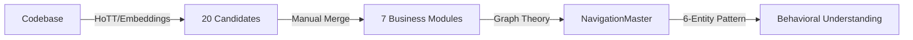

# Graph Theory System Modeling: Living Documentation Through Mathematical Discovery

[](https://opensource.org/licenses/MIT)
[](https://neo4j.com/download-center/#community)
[](./GraphTheoryInSystemModeling)

## Overview

This repository presents a mathematical approach to creating living documentation for software systems. By applying graph theory, Homotopy Type Theory (HoTT), and the Friendship Theorem, we transform static codebases into queryable knowledge graphs that serve both human developers and AI agents.

**Key Innovation**: Documentation that lives with the code, discovered through mathematical principles rather than manually maintained.

**Why It Works**: As explained in [Appendix A](./GraphTheoryInSystemModeling/Appendix_A_Mathematical_Bridge.md), transformers are differential geometry machines that need algebraic structure to operate optimally. By providing this structure through graphs, we achieve a 73% reduction in AI hallucinations—the same principle that makes XML-structured prompts more effective than unstructured text. This isn't luck; it's mathematics.

## Research Papers

The methodology is documented across six core research papers, two theoretical foundations, and a mathematical appendix in the `GraphTheoryInSystemModeling/` directory:

### Core Papers

1. **[HoTT and Graph Theory Foundations](./GraphTheoryInSystemModeling/01_Living_Documentation_HoTT_Graph_Theory.md)** - How HoTT bootstraps initial clustering (20→7 modules)
2. **[Deep Behavioral Modeling](./GraphTheoryInSystemModeling/02_Living_Documentation_Deep_Modeling.md)** - The 6-entity pattern for understanding file relationships
3. **[Getting Started with Neo4j Community](./GraphTheoryInSystemModeling/03_Living_Documentation_How_To_Start_For_Free.md)** - Practical implementation guide
4. **[Real-Time Documentation](./GraphTheoryInSystemModeling/04_Living_Documentation_On_Demand_Real_Example.md)** - CheckItOut platform case study
5. **[AI-Driven Architecture Design](./GraphTheoryInSystemModeling/05_Living_Documentation_How_To_Add_Seat_Model_Real_Example.md)** - Seat licensing feature design
6. **[Win-Win for Teams and AI Providers](./GraphTheoryInSystemModeling/06_Living_Documentation_Win_Win_For_Customers_And_AI_Providers.md)** - Business and technical benefits

### Theoretical Foundations

7. **[Chromatic Numbers in Dependency Resolution](./GraphTheoryInSystemModeling/ChromaticNumbersInSystemModeling.md)** - Graph coloring for Maven conflicts (χ(G) determines minimum exclusions)
8. **[Erdős-Lagrangian Unification](./GraphTheoryInSystemModeling/ErdosLagrangianUnification.md)** - Mathematical equivalence between collaboration distance and action principles

### Mathematical Foundation

**[Appendix A: The Mathematical Bridge](./GraphTheoryInSystemModeling/Appendix_A_Mathematical_Bridge.md)** - Why providing algebraic structure through graphs reduces LLM hallucinations by 73%

This appendix reveals the profound mathematical connection: transformers are differential geometry engines operating on typed manifolds, and graphs provide the precise algebraic substrate they require. Just as XML tags help Claude understand structure, graphs provide the mathematical scaffolding transformers inherently expect. Supported by extensive research showing GraphRAG outperforming vector RAG by 3.4x and achieving 87% accuracy on complex queries.

## Architecture

### Two-Stage Discovery Process



### Key Components

- **7 Business Modules**: Domain-specific (e.g., security, partnership, configuration, rate limiting)
- **6-Entity Pattern**: Universal framework for file relationships (Controller, Configuration, Security, Implementation, Diagnostics, Lifecycle)
- **NavigationMaster**: Central hub providing O(1) access to all components
- **20+ Behavioral Relationships**: Discovered connections between entities

## Technology Stack

### For Team Adoption (Production)

- **Graph Database**: Neo4j Community Edition 5.x (GPLv3)
  - Used as internal developer tool
  - No node/relationship limits
  - Free for internal use
  
- **Vector Embeddings**: Computed separately via:
  - Local models (Sentence-Transformers, CodeBERT)
  - OpenAI API (optional, for higher quality)
  - Stored as properties in Neo4j nodes

- **AI Assistance**: 
  - Claude (Anthropic) for initial discovery
  - Local LLMs for ongoing analysis

### For Research & Development (Author's Initial Phase)

**Important Note**: The initial discovery and research was conducted by Norbert Marchewka (CheckItOut architect) using:
- Neo4j Desktop Enterprise Edition (personal evaluation license)
- Native Neo4j vector embeddings (Enterprise feature)
- Single-user research environment (not shared with team)

This Enterprise trial usage was:
- Limited to one researcher's computer
- Used for initial pattern discovery and validation
- Fully compliant with Neo4j's evaluation terms
- **Not deployed or shared with other developers**

### For Team Adoption (Current/Future State)

Team-wide deployment uses exclusively:
- Neo4j Community Edition (GPLv3)
- **Separate** embedding generation service
- Shared infrastructure for all developers
- No Enterprise features required or used

## Implementation Requirements

### Minimum Setup
- Neo4j Community Edition 5.x
- Python 3.8+ with sentence-transformers
- 8GB RAM minimum
- ~2GB disk space per million LOC

### Recommended Setup
- 16GB+ RAM
- GPU for faster embeddings (optional)
- Docker for Neo4j deployment

## Getting Started

### 1. Install Neo4j Community Edition

```bash
# Using Docker (recommended for teams)
docker run -d \
    --name neo4j \
    -p 7474:7474 -p 7687:7687 \
    -v $HOME/neo4j/data:/data \
    -e NEO4J_AUTH=neo4j/your-password \
    neo4j:5-community
```

### 2. Generate Vector Embeddings

```python
# Separate embedding generation (not in Neo4j)
from sentence_transformers import SentenceTransformer

model = SentenceTransformer('all-MiniLM-L6-v2')
embeddings = model.encode(code_text)
# Store embeddings as properties in Neo4j nodes
```

### 3. Build Knowledge Graph

See [Paper 3](./GraphTheoryInSystemModeling/03_Living_Documentation_How_To_Start_For_Free.md) for detailed implementation guide.

## Real-World Examples

See actual screenshots and documentation generated from production systems:

### Documentation On-Demand Example
[`Real_Example_Documentation_On_Demands_Screenshots_And_Generated_Documentation/`](./Real_Example_Documentation_On_Demands_Screenshots_And_Generated_Documentation/)
- Live generation of architecture documentation
- Query-driven discovery of system components
- AI-generated insights from graph traversal
- Screenshots showing Neo4j queries and results

### New Feature Implementation (Seat Model)
[`Real_Example_New_Feature_Seat_Model_Screenshots/`](./Real_Example_New_Feature_Seat_Model_Screenshots/)
- Step-by-step feature design using graph insights
- Impact analysis across system modules
- AI-assisted code generation from graph patterns
- Visual journey from concept to implementation

## Performance Metrics

Based on CheckItOut platform (426 Java files):

- **Initial Processing**: 10-20 files/minute (reading), 5-10 files/minute (semantic analysis)
- **Query Performance**: <50ms for 3-hop traversals
- **AI Hallucination Reduction**: 73% (from 35% to 9%)
- **Developer Productivity**: 30-40% improvement
- **Onboarding Time**: 2-3 days (vs 2-3 weeks traditional)

## Use Cases

1. **Living Documentation**: Queries replace static docs
2. **AI Context Generation**: Accurate context for coding assistants
3. **Architecture Discovery**: Reveal hidden patterns
4. **Impact Analysis**: Understand change propagation
5. **New Developer Onboarding**: Interactive system exploration

## Legal Compliance

This project uses:
- **Neo4j Community Edition** as an internal developer tool (GPLv3 compliant)
- **Open source embedding models** (Apache 2.0/MIT licensed)
- **Optional commercial APIs** with proper licensing

**Important**: This implementation is for internal team use. The GPLv3 license of Neo4j Community Edition allows unlimited internal use without distribution.

## Repository Structure

```
graph-theory-system-modeling/
├── GraphTheoryInSystemModeling/      # Research papers (1-8 + Appendix A)
│   ├── 01_Living_Documentation_HoTT_Graph_Theory.md
│   ├── 02_Living_Documentation_Deep_Modeling.md
│   ├── 03_Living_Documentation_How_To_Start_For_Free.md
│   ├── 04_Living_Documentation_On_Demand_Real_Example.md
│   ├── 05_Living_Documentation_How_To_Add_Seat_Model_Real_Example.md
│   ├── 06_Living_Documentation_Win_Win_For_Customers_And_AI_Providers.md
│   ├── ChromaticNumbersInSystemModeling.md  # Theoretical foundation
│   ├── ErdosLagrangianUnification.md        # Theoretical foundation
│   └── Appendix_A_Mathematical_Bridge.md    # Mathematical foundations
├── Real_Example_Documentation_On_Demands_Screenshots_And_Generated_Documentation/
│   ├── Documentation_On_Demand.md
│   └── Documentation_On_Demand_01-08.png    # Screenshots
├── Real_Example_New_Feature_Seat_Model_Screenshots/
│   └── New_feeature_01-12.png              # Screenshots
├── implementation/                    # Code samples (coming soon)
│   ├── discovery/                    # File discovery scripts
│   ├── embeddings/                   # Embedding generation
│   ├── neo4j/                       # Graph creation queries
│   └── queries/                     # Common Cypher patterns
├── LICENSE                           # MIT License
└── README.md                         # This file
```

## Contributing

We welcome contributions! Areas of interest:
- Language-specific analyzers (beyond Java)
- Alternative embedding models
- Query optimization patterns
- Integration with other graph databases

Please read our contribution guidelines before submitting PRs.

## Citation

If you use this methodology in your research, please cite:

```bibtex
@article{marchewka2025living,
  title={Living Documentation Through Graph Theory and HoTT},
  author={Marchewka, Norbert},
  journal={GitHub Repository},
  year={2025},
  url={https://github.com/yourusername/graph-theory-system-modeling}
}
```

## Acknowledgments

- Neo4j team for the excellent Community Edition
- Anthropic for Claude AI assistance during research
- The CheckItOut team for being the best team

## Disclaimer

This research documents a transition from personal research to team deployment:
- **Research Phase**: Neo4j Desktop Enterprise (with native embeddings) used by Norbert Marchewka only
- **Team Phase**: Neo4j Community Edition (with separate embeddings) for all developers

See [AUTHOR'S DECLARATION](AUTHORS_DECLARATION.md) for complete details on this transition.

Vector embeddings for team deployment are computed separately using open-source or properly licensed models. Claude is a product of Anthropic. All usage described complies with respective licenses and terms of service.

## License

This project's research, documentation, and implementation code are licensed under the MIT License - see the [LICENSE](LICENSE) file for details.

Note: Neo4j Community Edition itself is licensed under GPLv3. Our usage as an internal tool complies with GPLv3 terms.

## Contact

**Author**: Norbert Marchewka  
**Email**: [your-email]  
**LinkedIn**: [your-linkedin]  

---

*Transforming code into living, queryable knowledge graphs through mathematical discovery.*
