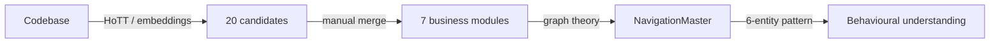

# Graph Theory System Modeling — living documentation as a typed knowledge graph

**A software system modelled as a graph a person and an AI agent can both navigate, and the
tooling built on it: prompt contracts, retrieval and reranking servers, a small local model
that abstains when the answer is not in the graph, and the harness that measures all of it.**

[](./LICENSE)
[](./GraphTheoryInSystemModeling)
[](./applications/CodeMap)
[](https://neo4j.com/download-center/#community)
[](https://check-it-out-dev.github.io/graph-theory-system-modeling/)
[](https://github.com/Check-It-Out-Dev/graph-theory-system-modeling/actions/workflows/ci.yml)
[](https://github.com/Check-It-Out-Dev/graph-theory-system-modeling/actions/workflows/code-scanning.yml)

▶ **[checkitout.app/technical-survey/engineering](https://checkitout.app/technical-survey/engineering#graph-topology)** —
the graph of a real system, drawn from its data, with the cost of an answer measured against
grep-and-read · **[the 90-second film](https://checkitout.app/codemap)** — every frame a real run.

## What this is

Documentation that is discovered rather than written: a codebase is indexed into a graph with a
three-level topology (one NavigationMaster → entity navigators → concrete implementations), every
subsystem is read through six behavioural roles (Controller, Configuration, Security,
Implementation, Diagnostics, Lifecycle), and the graph is what a developer or an agent queries
instead of reading everything. The economics are the point: retrieving *k* hops from a graph costs
O(k); pushing a codebase through a context window costs O(n) attention with documented degradation
in the middle, and it costs it again on every question.

It was built while building **[checkItOut](https://checkitout.app)** — an influencer-marketing
marketplace with Stripe billing and Polish e-invoicing that ran in production — and it is the
reason one person could keep a system that size navigable. Both halves of the platform are public
and are the case study for everything here.

## Run it

**CodeMap — the theory, shipped.** One command after cloning boots the graph engine, the local
model sidecar and a browser UI:

```bash
cd applications/CodeMap
python codemap.py up        # `python codemap.py check` verifies the pack and the model without starting anything
```

A 4B model (GGUF, plain CPU) navigates a precomputed graph pack through a 13-verb DSL; recurring
questions come from a curated cache; when the answer is not in the graph the model **abstains** and
offers — only with the user's consent — an escalation to a Claude API model. Windows users can take
the [22 MB installer](https://storage.waw.cloud.ovh.net/v1/AUTH_62ce8c0b4d874faa89fb3e086832f1a6/downloads/codemap/codemap-setup-1.2.0.exe)
(checksums beside it; it fetches the model itself, SHA-256 verified). The app's own README:
[applications/CodeMap/README.md](./applications/CodeMap/README.md).

**The MCP servers.** Retrieval and reranking as services an agent can call:
[`McpServerForEmbeddings/`](./McpServerForEmbeddings/) and
[`McpServerForReranking/`](./McpServerForReranking/) (Python, `pytest` in each), with the
deployable variants under [`services/`](./services/) (Modal apps for the embedding and reranking
models) and the graph-embedding pipeline in [`embeddings-service/`](./embeddings-service/).

**Your own codebase.** [Paper 3](./GraphTheoryInSystemModeling/03_Living_Documentation_How_To_Start_For_Free.md)
is the step-by-step guide on Neo4j Community Edition; the indexing and organising agents are the
prompt contracts in [`Promts/`](./Promts/); requirements and the team-adoption path are in
[docs/FAQ.md](./docs/FAQ.md) and [DEVELOPMENT_SETUP.md](./DEVELOPMENT_SETUP.md).

## Testing — how an AI system gets tested here

Most of this repository is the machinery that makes an LLM-backed system something you can write
assertions against:

| What | How it is tested | Where |
| :-- | :-- | :-- |
| **The two MCP servers** | 29 pytest tests between them, their own `pytest.ini`; retrieval and reranking as code that can fail a build | [`McpServerForEmbeddings/tests`](./McpServerForEmbeddings/tests), [`McpServerForReranking/tests`](./McpServerForReranking/tests) |
| **The navigator model** | An evaluation ladder with **execution-fingerprint judges**: an answer is compared with what the engine actually executes, never with an opinion about the text. Execution accuracy **0 → 0.98** across four training rounds (~$25 of GPU); abstention **1.0** on out-of-graph questions, with evidence | [`applications/CodeMap/training/eval_harness.py`](./applications/CodeMap/training/eval_harness.py), [`eval/q`](./applications/CodeMap/eval/q) — question bank, gold answers |
| **Untrained open models on the same graph** | The prompt-transfer ladder (Cypher anchors, step budgets): 0.031 → 0.246 by prompt alone, and why route-referees undercount foreign models | [`docs/06-prompt-transfer-findings.md`](./applications/CodeMap/docs/06-prompt-transfer-findings.md) |
| **The graph engine migration** | Neo4j → LadybugDB (MIT) accepted by **byte-identical gold answers across engines**; the from-scratch regeneration is a runbook | [`docs/05-regen-runbook.md`](./applications/CodeMap/docs/05-regen-runbook.md) |
| **All of it, on every push** | [`ci.yml`](.github/workflows/ci.yml) on a GitHub-hosted runner: the MCP pytest suites with the model mocked and CPU-only wheels, and the CodeMap engine check where the pack exists. Results land on the [quality dashboard](https://check-it-out-dev.github.io/graph-theory-system-modeling/) with a flaky list over the last ten runs; CodeQL and dependency review run beside it | [`.github/workflows/`](.github/workflows/) |
| **The prompts** | Written as XML contracts — 24 documents across five generations (V2–V5) — so an agent's behaviour has a specification to evaluate against | [`Promts/`](./Promts/) |
| **The partition itself** | Co-change evidence and lens gates over the V3 graph, as scripts with recorded evidence | [`papers/V3/experiments/`](./papers/V3/experiments/) |

The training method — open-book selection SFT, vocabulary-constrained decoding, preference
polish — is written up with the equations in
[docs/04-training-story.md](./applications/CodeMap/docs/04-training-story.md).

## Architecture — the method


```mermaid
graph LR
    A[Codebase] -->|HoTT / embeddings| B[20 candidates]
    B -->|manual merge| C[7 business modules]
    C -->|graph theory| D[NavigationMaster]
    D -->|6-entity pattern| E[Behavioural understanding]
```

- **NavigationMaster** — the hub node, after the Friendship Theorem: O(1) entry, at most two hops
  to any component, one canonical starting point for a person and for an agent.
- **The six-entity lens** — every subsystem read as Controller, Configuration, Security,
  Implementation, Diagnostics, Lifecycle; argued from R(3,3)=6 in Paper 2.
- **Typed relationships** — TRIGGERS, ORCHESTRATES, PROTECTS, VALIDATES, CONFIGURES, DEPENDS_ON and
  their kin carry the *why*, so impact analysis is a query before a change, not a search after an
  incident.
- **Structure for the model** — [Appendix A](./GraphTheoryInSystemModeling/Appendix_A_Mathematical_Bridge.md)
  argues why algebraic structure through graphs reduces hallucination (the case study's 35 % → 9 %),
  the same reason structured prompts outperform prose.

**The papers**, in reading order, under [`GraphTheoryInSystemModeling/`](./GraphTheoryInSystemModeling/):
[1 · HoTT and graph-theory foundations](./GraphTheoryInSystemModeling/01_Living_Documentation_HoTT_Graph_Theory.md) ·
[2 · Deep behavioural modelling](./GraphTheoryInSystemModeling/02_Living_Documentation_Deep_Modeling.md) ·
[3 · Getting started for free](./GraphTheoryInSystemModeling/03_Living_Documentation_How_To_Start_For_Free.md) ·
[4 · Documentation on demand, a real example](./GraphTheoryInSystemModeling/04_Living_Documentation_On_Demand_Real_Example.md) ·
[5 · Adding a feature (seat model), a real example](./GraphTheoryInSystemModeling/05_Living_Documentation_How_To_Add_Seat_Model_Real_Example.md) ·
[6 · Win-win for teams and AI providers](./GraphTheoryInSystemModeling/06_Living_Documentation_Win_Win_For_Customers_And_AI_Providers.md) ·
[Chromatic numbers in dependency resolution](./GraphTheoryInSystemModeling/ChromaticNumbersInSystemModeling.md) ·
[Erdős–Lagrangian unification](./GraphTheoryInSystemModeling/ErdosLagrangianUnification.md) ·
[Appendix A · the mathematical bridge](./GraphTheoryInSystemModeling/Appendix_A_Mathematical_Bridge.md).
The V3 research arc — the tri-lens embeddings, the Magnetic Laplacian, Leiden communities, and the
claims later withdrawn — is under [`papers/V3/`](./papers/V3/) and [`WorkingNotes/`](./WorkingNotes/).

**The case study.** [checkitout-backend](https://github.com/Check-It-Out-Dev/checkitout-backend)
(Spring Boot on Java 21: 38 entities, 50 controllers, a 34-file Cucumber corpus, an OpenAPI contract
taken from a server that booted) is modelled with the topology and the lens above;
[checkitout-frontend](https://github.com/Check-It-Out-Dev/checkitout-frontend) (Angular 22, 1,884
tests across nine tiers as measured there on 2026-09-08) generates its client from that contract.
The screenshots in
[`Real_Example_Documentation_On_Demands_Screenshots_And_Generated_Documentation/`](./Real_Example_Documentation_On_Demands_Screenshots_And_Generated_Documentation/)
and [`Real_Example_New_Feature_Seat_Model_Screenshots/`](./Real_Example_New_Feature_Seat_Model_Screenshots/)
are from that work: an agent inside a 200k context window reconstructing the architecture from the
graph — which files exist, which events they raise, what depends on what — and then using it to
place a new feature. The author's own account of the mathematics is in
[docs/AUTHORS-NOTE.md](./docs/AUTHORS-NOTE.md).

## Evaluation — present, and what comes next

This is where the work continues. Dated 2026-09. ✅ built · 🟡 under way · ⬜ designed.

|     | What | Detail |
| :-- | :-- | :-- |
| ✅ | **Prompts as contracts** | 24 XML/markdown contracts across five generations; an agent has a specification, so its output has something to be measured against |
| ✅ | **Execution-fingerprint oracles** | The eval ladder compares answers with execution, not with a judge's opinion of the text; gold answers are byte-identical across two graph engines |
| ✅ | **Abstention as a tested property** | The navigator abstains at 1.0 on out-of-graph questions — an oracle that knows the boundary of its knowledge is one you can write assertions against |
| ✅ | **SFT/DPO training with its own evaluation** | Four rounds, 0 → 0.98 execution accuracy, the harness and the data generators in `training/` |
| 🟡 | **Prompt and model evaluation as a CI gate** | The question bank with expected answers runs on every prompt or model change; a regression in execution accuracy or abstention fails the build the way a red test does |
| 🟡 | **Measuring the quality of an AI system in production** | Three rates on real traffic: answers grounded in the graph, abstentions, and drift between the graph version and the model version; sampled and judged with the same execution oracles |
| ⬜ | **Evaluation at scale** | The same ladders sharded across ephemeral runners alongside the platform's test suites, reports aggregated with them |
| ⬜ | **More languages** | The indexing agents are Java-first; TypeScript is the next corpus |

## The rest of the estate

Three repositories and a running site, and each answers the question the previous one raises.

| If you are wondering | Go here |
| :-- | :-- |
| "Does it work on something real?" | **[checkitout.app/technical-survey/engineering](https://checkitout.app/technical-survey/engineering)** — the estate in one screen, the graph drawn from the real data, what is under way |
| "Is the test strategy backed by code?" | **[checkitout-frontend](https://github.com/Check-It-Out-Dev/checkitout-frontend)** — nine test tiers, fifteen gates, every published number measured and gated |
| "Is the other side of the seam real?" | **[checkitout-backend](https://github.com/Check-It-Out-Dev/checkitout-backend)** — the business rules, the contract, the Cucumber corpus |

## Repository structure

```
graph-theory-system-modeling/
├── GraphTheoryInSystemModeling/   the papers (1–6), two theoretical foundations, Appendix A
├── papers/V3/                     the V3 research arc and its experiments (co-change, lens gates, partition)
├── applications/CodeMap/          the app: engine, navigator model, DSL, eval, training, installer, docs
├── McpServerForEmbeddings/        MCP server — embeddings (Python, pytest)
├── McpServerForReranking/         MCP server — reranking (Python, pytest)
├── services/                      embeddings-mcp, reranker-mcp, Modal apps
├── embeddings-service/            the graph-embedding pipeline: delta extraction, hyperedges, embedding server
├── Promts/                        24 prompt contracts across five generations, and two prompt-engineering guides
├── Real_Example_*/                screenshots from the checkItOut case study
├── WorkingNotes/                  the tri-lens pipeline notes and other working documents
├── docs/                          FAQ, the author's note
├── AUTHORS_DECLARATION.md · COMPLIANCE.md · DEVELOPMENT_SETUP.md · CHANGELOG.md · LICENSE
```

## Licence, compliance, citation

MIT for the research, the documentation and the code — see [LICENSE](./LICENSE). Neo4j Community
Edition is GPLv3 and is used as an internal tool, which its licence permits; the CodeMap
authoring stack has run on LadybugDB (MIT) since 2026. The research-phase and team-phase tool
usage is declared in [AUTHORS_DECLARATION.md](./AUTHORS_DECLARATION.md) and
[COMPLIANCE.md](./COMPLIANCE.md). Claude is a product of Anthropic.

```bibtex
@misc{marchewka2025living,
  title  = {Living Documentation Through Graph Theory and HoTT},
  author = {Marchewka, Norbert},
  year   = {2025},
  url    = {https://github.com/Check-It-Out-Dev/graph-theory-system-modeling}
}
```

## Contact

**Norbert Marchewka** · [LinkedIn](https://www.linkedin.com/in/norbert-marchewka-292377129/) ·
norbert_marchewka@checkitout.app. Questions go to public GitHub issues, where the answer helps
everyone; the author does not offer paid consulting on this method. Contributions are welcome and
stay under MIT — language analysers beyond Java, embedding models, query patterns, other graph
databases.
