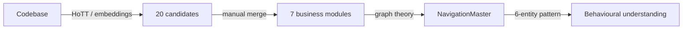

# Graph Theory System Modeling — living documentation as a typed knowledge graph

**A software system modelled as a graph a person and an AI agent can both navigate — and the method
that keeps the agents working in it from turning the code base into spaghetti: a conventions prompt
treated as code under test, measured, optimised and certified on tasks it never saw.**

[](./LICENSE)
[](./GraphTheoryInSystemModeling)
[](./applications/CodeMap)
[](https://neo4j.com/download-center/#community)
[](https://check-it-out-dev.github.io/graph-theory-system-modeling/)
[](https://github.com/Check-It-Out-Dev/graph-theory-system-modeling/actions/workflows/ci.yml)
[](https://github.com/Check-It-Out-Dev/graph-theory-system-modeling/actions/workflows/dependency-review.yml)
[](https://github.com/Check-It-Out-Dev/graph-theory-system-modeling/actions/workflows/sonar.yml)

▶ **[checkitout.app/technical-survey/engineering](https://checkitout.app/technical-survey/engineering#graph-topology)** —
the graph of a real system, drawn from its data, with the cost of an answer measured against
grep-and-read · **[the 90-second film](https://checkitout.app/codemap)** — every frame a real run.

The README has two parts. **[Part 1](#part-1--the-graph-context-engineering-for-a-code-base)** is the
graph: why an agent should query a code base instead of reading it. **[Part 2](#part-2--how-to-make-sure-ai-wont-turn-your-codebase-into-spaghetti)**
is how to make the agents that work in it follow the team's conventions, and how to prove they do.

---

# Part 1 — The graph: context engineering for a code base

## Why a code graph

Documentation that is discovered rather than written: a codebase is indexed into a graph with a
three-level topology (one NavigationMaster → entity navigators → concrete implementations), every
subsystem is read through six behavioural roles (Controller, Configuration, Security,
Implementation, Diagnostics, Lifecycle), and the graph is what a developer or an agent queries
instead of reading everything. The economics are the point: retrieving *k* hops from a graph costs
O(k); pushing a codebase through a context window costs O(n) attention with documented degradation
in the middle, and it costs it again on every question. For an agent this is **context
engineering**: it gets pointers to the few files that matter, not the contents of every file it
might need, and spends its tokens on the change instead of on finding where the change goes.

It was built while building **[checkItOut](https://checkitout.app)** — an influencer-marketing
marketplace with Stripe billing and Polish e-invoicing that ran in production — and it is the
reason one person could keep a system that size navigable. Both halves of the platform are public
and are the case study for everything here.

## How it is built


```mermaid
graph LR
    A[Codebase] -->|HoTT / embeddings| B[20 candidates]
    B -->|manual merge| C[7 business modules]
    C -->|graph theory| D[NavigationMaster]
    D -->|6-entity pattern| E[Behavioural understanding]
```

- **NavigationMaster** — the hub node, after the Friendship Theorem: O(1) entry, at most two hops
  to any component, one canonical starting point for a person and for an agent.
- **The six-entity lens** — every subsystem read as Controller, Configuration, Security,
  Implementation, Diagnostics, Lifecycle; argued from R(3,3)=6 in Paper 2.
- **Typed relationships** — TRIGGERS, ORCHESTRATES, PROTECTS, VALIDATES, CONFIGURES, DEPENDS_ON and
  their kin carry the *why*, so impact analysis is a query before a change, not a search after an
  incident.
- **Structure for the model** — [Appendix A](./GraphTheoryInSystemModeling/Appendix_A_Mathematical_Bridge.md)
  argues why algebraic structure through graphs reduces hallucination (the case study's 35 % → 9 %),
  the same reason structured prompts outperform prose.

**The papers**, in reading order, under [`GraphTheoryInSystemModeling/`](./GraphTheoryInSystemModeling/):
[1 · HoTT and graph-theory foundations](./GraphTheoryInSystemModeling/01_Living_Documentation_HoTT_Graph_Theory.md) ·
[2 · Deep behavioural modelling](./GraphTheoryInSystemModeling/02_Living_Documentation_Deep_Modeling.md) ·
[3 · Getting started for free](./GraphTheoryInSystemModeling/03_Living_Documentation_How_To_Start_For_Free.md) ·
[4 · Documentation on demand, a real example](./GraphTheoryInSystemModeling/04_Living_Documentation_On_Demand_Real_Example.md) ·
[5 · Adding a feature (seat model), a real example](./GraphTheoryInSystemModeling/05_Living_Documentation_How_To_Add_Seat_Model_Real_Example.md) ·
[6 · Win-win for teams and AI providers](./GraphTheoryInSystemModeling/06_Living_Documentation_Win_Win_For_Customers_And_AI_Providers.md) ·
[Chromatic numbers in dependency resolution](./GraphTheoryInSystemModeling/ChromaticNumbersInSystemModeling.md) ·
[Erdős–Lagrangian unification](./GraphTheoryInSystemModeling/ErdosLagrangianUnification.md) ·
[Appendix A · the mathematical bridge](./GraphTheoryInSystemModeling/Appendix_A_Mathematical_Bridge.md).
The V3 research arc — the tri-lens embeddings, the Magnetic Laplacian, Leiden communities, and the
claims later withdrawn — is under [`papers/V3/`](./papers/V3/) and [`WorkingNotes/`](./WorkingNotes/).

**The case study.** [checkitout-backend](https://github.com/Check-It-Out-Dev/checkitout-backend)
(Spring Boot on Java 21: 38 entities, 50 controllers, a 34-file Cucumber corpus, an OpenAPI contract
taken from a server that booted) is modelled with the topology and the lens above;
[checkitout-frontend](https://github.com/Check-It-Out-Dev/checkitout-frontend) (Angular 22, 1,884
tests across nine tiers as measured there on 2026-09-08) generates its client from that contract.
The screenshots in
[`Real_Example_Documentation_On_Demands_Screenshots_And_Generated_Documentation/`](./Real_Example_Documentation_On_Demands_Screenshots_And_Generated_Documentation/)
and [`Real_Example_New_Feature_Seat_Model_Screenshots/`](./Real_Example_New_Feature_Seat_Model_Screenshots/)
are from that work: an agent inside a 200k context window reconstructing the architecture from the
graph and then using it to place a new feature. The author's own account of the mathematics is in
[docs/AUTHORS-NOTE.md](./docs/AUTHORS-NOTE.md).

## Run it

**CodeMap — the theory, shipped.** One command after cloning boots the graph engine, the local
model sidecar and a browser UI:

```bash
cd applications/CodeMap
python codemap.py up        # `python codemap.py check` verifies the pack and the model without starting anything
```

A 4B model (GGUF, plain CPU) navigates a precomputed graph pack through a 13-verb DSL; recurring
questions come from a curated cache; when the answer is not in the graph the model **abstains** and
offers — only with the user's consent — an escalation to a Claude API model. Windows users can take
the [22 MB installer](https://storage.waw.cloud.ovh.net/v1/AUTH_62ce8c0b4d874faa89fb3e086832f1a6/downloads/codemap/codemap-setup-1.2.0.exe)
(checksums beside it; it fetches the model itself, SHA-256 verified). The app's own README:
[applications/CodeMap/README.md](./applications/CodeMap/README.md).

**The MCP servers.** Retrieval and reranking as services an agent can call:
[`McpServerForEmbeddings/`](./McpServerForEmbeddings/) and
[`McpServerForReranking/`](./McpServerForReranking/) (Python, `pytest` in each), with the
deployable variants under [`services/`](./services/) and the graph-embedding pipeline in
[`embeddings-service/`](./embeddings-service/). The served graph MCP for Claude Code is
[CodeMap Remote](#codemap-remote--the-graph-as-a-served-mcp).

**Your own codebase.** [Paper 3](./GraphTheoryInSystemModeling/03_Living_Documentation_How_To_Start_For_Free.md)
is the step-by-step guide on Neo4j Community Edition; the indexing and organising agents are the
prompt contracts in [`Promts/`](./Promts/); requirements and the team-adoption path are in
[docs/FAQ.md](./docs/FAQ.md) and [DEVELOPMENT_SETUP.md](./DEVELOPMENT_SETUP.md).

## Testing — how an AI system gets tested here

| What | How it is tested | Where |
| :-- | :-- | :-- |
| **The two MCP servers** | 26 pytest tests between them, 22 of which run in CI — the four that load the real model are marked `slow` and `integration` and stay out, which is why the suites need no GPU | [`McpServerForEmbeddings/tests`](./McpServerForEmbeddings/tests), [`McpServerForReranking/tests`](./McpServerForReranking/tests) |
| **The navigator model** | An evaluation ladder with **execution-fingerprint judges**: an answer is compared with what the engine actually executes, never with an opinion about the text. Execution accuracy **0 → 0.98** across four training rounds; abstention **1.0** on out-of-graph questions | [`training/eval_harness.py`](./applications/CodeMap/training/eval_harness.py), [`eval/q`](./applications/CodeMap/eval/q) |
| **Untrained open models on the same graph** | The prompt-transfer ladder: 0.031 → 0.246 by prompt alone, and why route-referees undercount foreign models | [`docs/06-prompt-transfer-findings.md`](./applications/CodeMap/docs/06-prompt-transfer-findings.md) |
| **The graph engine migration** | Neo4j → LadybugDB (MIT) accepted by **byte-identical gold answers across engines** | [`docs/05-regen-runbook.md`](./applications/CodeMap/docs/05-regen-runbook.md) |
| **The evaluation itself** | The prompt's contract with the parser, the scorer's arithmetic, the grammar's verdicts on recorded output, and the numbers copied into prose are gated on every push, in 0.2 s, by replaying nine frozen model runs — 4,936 recorded DSL steps — with no GPU, no model and no network | [`applications/CodeMap/eval/ci`](./applications/CodeMap/eval/ci) |
| **A conventions prompt for a coding agent** | 17 deterministic checks on the agent's diff, hidden acceptance tests per task, a calibrated judge, GEPA with a plateau stop, a hold-out certification — [Part 2](#part-2--how-to-make-sure-ai-wont-turn-your-codebase-into-spaghetti) | [`applications/CodeMap/eval/put`](./applications/CodeMap/eval/put) |
| **All of it, on every push** | [`ci.yml`](.github/workflows/ci.yml): the MCP suites with the model mocked, the evaluation gate, the engine check; results on the [quality dashboard](https://check-it-out-dev.github.io/graph-theory-system-modeling/) with a flaky list; CodeQL and dependency review beside it | [`.github/workflows/`](.github/workflows/) |
| **Which findings apply** | SonarCloud's exemptions are written down with their reasons next to the fixes; the rules stay on for the servers that take input from elsewhere | [`sonar-project.properties`](./sonar-project.properties) |

---

# Part 2 — How to make sure AI won't turn your codebase into spaghetti

## The problem

Every coding agent brings its own habits. Put five of them on one code base — or one agent across five
sessions — and the code base collects five ways to inject a dependency, three ways to send a notification and
a scheduled job that runs on every instance at once. Each change works on the day it is written; the cost arrives
later, when nobody can predict where anything is. Most teams answer with a conventions file for the agent
(`CLAUDE.md`, `AGENTS.md`, a rules folder) and hope. This part is the other answer: **treat the conventions prompt
as code under test** — declare what "following the conventions" means, measure it on real tasks, improve the
prompt against the measurement, and ship it only when it wins on tasks it never saw.

The case study is the backend of checkItOut (Spring Boot, Java 21). Its written conventions are clear
(CONTRIBUTING, the architecture guide, the test guides), and the code base follows them only in part: 7 of 40
entities carry `@Version`, 9 of 23 `@Scheduled` methods a lock, and 69 fields are still `@Autowired`. That is why
every check below looks at **the agent's diff**, never at the tree: an agent that imitates its neighbours would
otherwise be graded as compliant.

## Prompt evaluation — the pipeline and the math

```
instance = (prompt vN, 10 tasks with hidden tests, contract.json: rule -> check, judge rubric, weights)
   for each (prompt, task, replicate):
   fresh worktree -> claude -p (Sonnet coder, prompt as CLAUDE.md, code-graph MCP) -> diff + tool trace
   -> build, the agent's own tests, hidden acceptance tests, pass-to-pass tests
   -> 17 deterministic checks on the diff and the trace  +  an Opus judge blind to the prompt
   -> score S = sum of w_i * m_i
GEPA over the prompt (6 training tasks) until the plateau rule stops it
certification: seed x3 and candidate x4 on all 10 tasks -> the hold-out verdict -> CLAUDE.md on a branch
```

| Element | Its role |
| :-- | :-- |
| **The prompt under test** | A conventions manual in XML, one `<rule id>` per convention, rendered with a checksum so a run can prove the model read all of it |
| **Tasks** | Ten small real features at one commit of the backend — a nightly job, an after-commit notification, a vendor behind a port, an endpoint, a schema change — six for training, four held out and never shown to the optimiser. Each has a card the agent sees and **hidden acceptance tests** it never sees (fail on the base commit, pass on a hand-written reference, both proven twice) |
| **The contract** | Every rule the prompt states has a deterministic predicate over the agent's diff or tool trace; a unit test fails when a rule has no check |
| **Runner** | One fresh git worktree per run, `claude -p` on the Claude Code subscription, a Bash allowlist, an output-token budget that ends a runaway session |
| **Checks** | 17 rules — graph first, example read before the first edit, feature packages, constructor injection, after-commit listeners, scheduler locks, ports and adapters, translatable errors, Liquibase changesets, optimistic locking, guarded endpoints, DTO naming, unit tests, build, scope, one pass — each proven on a fixture that breaks it |
| **Judge** | Claude Opus grades correctness, convention fit, design fit (the anti-spaghetti score), test quality and graph use on a 1–5 rubric; it sees the team's rules and the unchanged code the diff touches, never the prompt being tested |
| **Score** | S = Σ wᵢ·mᵢ: hidden tests 0.30, convention checks 0.15, own tests 0.10, process 0.10, judge 0.35 |
| **Noise floor δ** | δ = max(the judge's test-retest MAD, 1.96 · pooled SD of replicates · √(2 / (T·k))): no gain smaller than δ is called a gain |
| **GEPA** | Evolves the prompt (below); stops when three iterations in a row gain no more than δ |
| **Certification** | The seed and the candidate replicated on all ten tasks; the verdict rests on the four held-out tasks only |
| **Promotion** | Only a certified winner becomes the repository's `CLAUDE.md`, on a branch, merged by a person |
| **Evidence** | Every campaign is a GitHub Actions run on a self-hosted runner, its artifacts committed in `eval/put/runs/`, its gauges on a [public dashboard](https://checkitoutapp.grafana.net/public-dashboards/f568734955de418b87a802ffbb562b49) |

**GEPA in plain terms.** GEPA keeps a pool of candidate prompts, starting from the seed. Each iteration takes three
training tasks, runs the current candidate on them, and collects feedback text: which rules failed, which hidden
tests failed, the judge's reasons with code names masked. A reflection model (Claude Opus) reads only that
behaviour-level feedback and rewrites the manual; a guard refuses a rewrite that quotes identifiers from the hidden
tests or the reference solutions, drops a rule or grows past 24,000 characters. The rewrite enters the pool only if
it beats its parent on those three tasks, and then it is scored on all six. Selection is Pareto per task, so a
candidate that is best on one hard task survives beside the one with the best average. What our objective adds to
stock GEPA: deterministic per-rule checks in the feedback, a judge that never sees the prompt, δ as the acceptance
floor, and a ceiling test that turns "the prompt cannot teach this rule" into a recommendation for a CI check.

The statistics — Wilson intervals per rule (a rule is **obligatory** only when its lower bound reaches 0.90, which
takes at least 35 runs without a failure), the paired bootstrap over held-out tasks, the sign test, and the
judge-agreement measures — are in [`eval/put/METRICS.md`](./applications/CodeMap/eval/put/METRICS.md); the design and
decision log is D-R29 onwards in [`docs/07-ai-quality-governance.md`](./applications/CodeMap/docs/07-ai-quality-governance.md),
the method in [`docs/09-prompt-under-test.md`](./applications/CodeMap/docs/09-prompt-under-test.md).

## Criteria for a conventions prompt

The criteria are the contract of the instance; for another prompt only the criteria and the example tasks change,
the pipeline stays. For this one:

| Criterion | Measured by | Weight |
| :-- | :-- | :-- |
| The task is done | hidden acceptance tests passed (0 if the build fails) | 0.30 |
| The conventions are followed | the deterministic checks that apply to the task, on the agent's diff | 0.15 |
| The change comes with tests | a new `*UnitTest`, no Spring context, at most three mocks, compiles and passes | 0.10 |
| The agent works the team's way | the graph queried before the first edit; an existing example read before writing a new kind of class | 0.10 |
| Convention fit, design fit, correctness, test quality, graph use | the judge, 1–5 each; the first three it shares with a person were calibrated against reference grades, correctness and graph use sit beside deterministic signals (hidden tests, graph first) | 0.35 |

With this repository's earlier graph-navigation evaluation (the Erdős architecture manual) only the criteria and the
examples change: answers graded against the execution oracle instead of diffs graded against conventions.

## Calibrating the judge — checking its scores against our own

A third of the score comes from an LLM judge, so the judge is graded before its numbers are used. Scores should be
set and calibrated by people on example tasks; the pipeline's job is to make that cheap and honest:

1. **Anchors with bad changes in them.** A sample of real runs across the judge's range, plus deliberately degraded
   variants (field injection, a missing lock, a service importing its adapter, a listener inside the transaction).
   A good prompt writes good code; without bad anchors, agreement says nothing about whether the judge catches bad code.
2. **Blind re-grading.** A reviewer grades the same changes on the same rubric, without seeing the judge's scores.
3. **Comparison.** Exact agreement, agreement at the ≥ 4 line with its prevalence, κ, Gwet's AC1, Spearman, and for
   every disagreement whether the judge's own second pass closes it (noise) or repeats it (bias).
4. **Adjudication.** Every gap argued on the code: the judge was wrong, the reviewer was, or it is taste.
5. **Revision, only when it pays** — for a pattern that repeats and steers the optimisation; then re-measure
   everything, and stop before the anchors become the rubric's training data.

Here the review found the judge **systematically soft on design**: it praised a new method that duplicated an
existing one (it saw only the diff, never the code the diff repeats), and it rated an unlocked job running on every
instance as a mild smell. Rubric r5 gives the judge the unchanged text of the files a change modifies and names those
patterns. Re-measured on the same twelve anchors, design-fit agreement went from 0.58 to 0.92 exact
(Spearman 0.65 → 0.97) and the judge's own test-retest noise fell (MAD of score 0.017 → 0.009). Not everything
improved: pooled agreement at the ≥ 4 line slipped (AC1 0.90 → 0.85), because three cells now sit on the other side
of the line — two of them flip back on the judge's own second pass, and on the third (a service importing its
adapter) the judge counts the broken rule and still gives 4, which the deterministic ports check fails regardless.
r5 was frozen there: a third revision fitted to the same twelve anchors would make them the rubric's training data.
The record, gap by gap, is in
[`eval/put/judge/reference-scores.json`](./applications/CodeMap/eval/put/judge/reference-scores.json).

## Two prompts

Two prompts can be evaluated this way: the coding agent's, and the PR reviewer in CI that checks conventions on every
pull request. Both should be — the judge first, because an uncalibrated judge turns every later number into its own
opinion. Here we take the coding agent; the reviewer is the same pipeline with different rules and tasks
([`instances/pr-reviewer/contract.json`](./applications/CodeMap/eval/put/instances/pr-reviewer/contract.json)) and is
not run.

## Results

**The seed** is the team's CONTRIBUTING transcribed into the manual format, not tuned. It was already strong: every
seed run built and passed every hidden acceptance test, and the conventions that apply to each task held almost
everywhere. Its one real gap was tests — the agent wrote a new unit-test class in 18 of 30 seed runs.

**GEPA** went from 0.917 → 0.979 on the training tasks in four candidates and stopped on the plateau rule (54 coding
runs, 77 minutes). The reflector wrote behaviour, not task knowledge: a "Check:" line under every rule that the agent
runs on its own diff, a unit-test standard, and a self-review step before the end.

**Certification** — the seed three times and the candidate four times on all ten tasks:

| | seed v1 | GEPA candidate |
| :-- | --: | --: |
| training tasks (in-sample, best-of-k) | 0.907 | 0.970 |
| hold-out tasks (never seen by GEPA) | 0.902 | 0.965 |

**The verdict is no.** The hold-out gain is 0.063 (95 % CI −0.007 to 0.135; δ 0.030): twice the noise floor, but the
interval — over four held-out tasks — does not exclude zero, and that was the rule declared before the run. The gain
is where the seed was weak (two hold-out tasks rose by about 0.15 and 0.11 because the agent now writes tests:
`tests_written` 18/30 → 37/40) and it is flat or slightly negative where the seed was already at the ceiling (one of
four candidate runs failed a hidden test on the notification task). The candidate also cost something: a manual twice
as long, and one run that widened its scope because a new rule sends the agent into every mapper of a changed DTO.
The promotion gate stayed closed and the seed remains the team's prompt; adding replicates after seeing an interval
that just misses would be optional stopping, so a second certification needs new held-out tasks declared first.

**What the rules say.** Obligatory for the candidate over 40 runs (lower Wilson bound ≥ 0.90): graph first, feature
packages, constructor injection, the build, one pass. Below the bound — *rules the prompt could not teach to that
standard*, recommended to enforcement instead: an example read before a new class (a session hook), a new unit test
with every main change (a CI gate), and scope (a diff path gate). The task-specific rules (locks, listeners, ports,
changesets, guards) held in every run that touched them, but 8 to 12 runs per rule cannot reach the 0.90 bound, so
they are reported with their intervals, not claimed. Every figure and run is in
[`eval/put/RUNS.md`](./applications/CodeMap/eval/put/RUNS.md).

## What this does not show

- **The training gain is in-sample and best-of-k.** Only the held-out figure is a claim, and four held-out tasks give
  a wide interval (the sign test cannot reach 0.05 with four tasks; the bootstrap interval is the primary figure).
- **Synthetic tasks, one code base.** Ten small features in one Spring Boot repository, at one commit.
- **One model family.** The coder is Claude Sonnet, the judge and the reflector Claude Opus, on a subscription, dated
  September 2026; a model change is a new measurement. The calibration reviewer is the same family as the judge,
  which inflates agreement where they share a blind spot.
- **The judge is an LLM.** Calibrated on twelve anchors with repeatability measured, not proven on a rare kind of
  defect the anchors do not contain.
- **δ is a floor, not a variance model.**
- **Graph versus no graph is out of scope.** The code graph is one rule of the manual here, not the thing measured.
- **The PR-reviewer prompt is described, not run.**

---

## Evaluation — present, and what comes next

Dated 2026-09. ✅ built · 🟡 under way · ⬜ designed.

|     | What | Detail |
| :-- | :-- | :-- |
| ✅ | **Prompts as contracts** | 24 XML/markdown contracts across five generations; an agent has a specification, so its output has something to be measured against |
| ✅ | **Execution-fingerprint oracles** | The eval ladder compares answers with execution, not with a judge's opinion of the text; gold answers are byte-identical across two graph engines |
| ✅ | **Abstention as a tested property** | The navigator abstains at 1.0 on out-of-graph questions — an oracle that knows the boundary of its knowledge is one you can write assertions against |
| ✅ | **SFT/DPO training with its own evaluation** | Four rounds, 0 → 0.98 execution accuracy, the harness and the data generators in `training/` |
| ✅ | **Prompt and model evaluation as a CI gate** | 198 checks on every push, no GPU and no model: the master prompt's verb table must equal the parser's in both directions, nine frozen model runs must re-score to their own published summaries, 4,936 recorded DSL steps must draw the same verdicts from today's grammar, and every evaluation figure in the prose — this README's Part 2 included — is tied to the artifact behind it — [`eval/ci/README.md`](./applications/CodeMap/eval/ci/README.md) says why that is the half that rots |
| ✅ | **A conventions prompt under test** | Part 2: the pipeline built and run end to end on the self-hosted runner, the judge calibrated and revised, GEPA to its plateau; the first candidate was not certified, and the report says why |
| ⬜ | **The model itself back in the loop** | Re-running the navigator on a schedule needs the 2.5 GB checkpoint and the graph pack published; a publishing decision, not a CI one |
| 🟡 | **Measuring the quality of an AI system in production** | Live since 2026-09-16 on the served MCP: grounded, correct and abstention rates from a judge calibrated against the execution oracle (κ 0.84), ratings from synthetic users who verify pointers — one artifact per night in `applications/CodeMap/eval/quality/runs/`, the [quality page](https://check-it-out-dev.github.io/graph-theory-system-modeling/quality/) and public dashboards; ✅ once a full night's judge is calibrated on that night's own rows (κ ≥ 0.6) and the gain carries at least thirty baseline pairs — the first full night (2026-09-17) met neither, and says so |
| ⬜ | **A second certification and the PR-reviewer prompt** | New held-out tasks declared before the run; the same pipeline over the CI reviewer's prompt |
| ⬜ | **More languages** | The indexing agents are Java-first; TypeScript is the next corpus |

## CodeMap Remote — the graph as a served MCP

The served half of CodeMap: a lightweight MCP whose answering model is Claude Sonnet on the owner's subscription,
six synthetic users who verify pointers in their own checkouts and rate every answer, a calibrated judge, and a graph
that follows the code through decisions taken on GitHub.

- **Ask it**: `claude mcp add --transport http codemap https://codemap.checkitout.app/mcp --header "Authorization: Bearer $CODEMAP_TOKEN" --header "X-CodeMap-User: owner"` — seven tools, pointers instead of file contents ([`applications/CodeMap/remote/README.md`](./applications/CodeMap/remote/README.md)).
- **Read the numbers**: the [quality page](https://check-it-out-dev.github.io/graph-theory-system-modeling/quality/) and the public dashboards listed in [`observability/grafana/public-urls.md`](./applications/CodeMap/observability/grafana/public-urls.md).
- **How it is governed**: [model card](./applications/CodeMap/MODEL_CARD.md) · [evaluation card](./applications/CodeMap/EVAL_CARD.md) · [data card](./applications/CodeMap/DATA_CARD.md) · [threat model](./applications/CodeMap/THREAT_MODEL.md) · [incidents](./applications/CodeMap/INCIDENTS.md).

Security is designed for a small team: identity is a header from an enum and one shared token; a full version needs
per-person accounts (OAuth 2.1 as the MCP specification describes), which is out of scope. In normal use a team runs
the same server locally with the graph pack from the latest Release, connected to their own Claude Code subscription.

## The rest of the estate

| If you are wondering | Go here |
| :-- | :-- |
| "Does it work on something real?" | **[checkitout.app/technical-survey/engineering](https://checkitout.app/technical-survey/engineering)** — the estate in one screen |
| "Is the test strategy backed by code?" | **[checkitout-frontend](https://github.com/Check-It-Out-Dev/checkitout-frontend)** — nine test tiers, fifteen gates, every published number measured and gated |
| "Is the other side of the seam real?" | **[checkitout-backend](https://github.com/Check-It-Out-Dev/checkitout-backend)** — the business rules, the contract, the Cucumber corpus, and the code base Part 2 measures on |

## Repository structure

```
graph-theory-system-modeling/
├── GraphTheoryInSystemModeling/   the papers (1–6), two theoretical foundations, Appendix A
├── papers/V3/                     the V3 research arc and its experiments (co-change, lens gates, partition)
├── applications/CodeMap/          the app: engine, navigator model, DSL, eval (incl. eval/put, Part 2), training, installer, docs
├── McpServerForEmbeddings/        MCP server — embeddings (Python, pytest)
├── McpServerForReranking/         MCP server — reranking (Python, pytest)
├── services/                      embeddings-mcp, reranker-mcp, Modal apps
├── embeddings-service/            the graph-embedding pipeline: delta extraction, hyperedges, embedding server
├── Promts/                        24 prompt contracts across five generations, and two prompt-engineering guides
├── Real_Example_*/                screenshots from the checkItOut case study
├── WorkingNotes/                  the tri-lens pipeline notes and other working documents
├── docs/                          FAQ, the author's note
├── AUTHORS_DECLARATION.md · COMPLIANCE.md · DEVELOPMENT_SETUP.md · CHANGELOG.md · LICENSE
```

## Licence, compliance, citation

MIT for the research, the documentation and the code — see [LICENSE](./LICENSE). Neo4j Community
Edition is GPLv3 and is used as an internal tool, which its licence permits; the CodeMap
authoring stack has run on LadybugDB (MIT) since 2026. The research-phase and team-phase tool
usage is declared in [AUTHORS_DECLARATION.md](./AUTHORS_DECLARATION.md) and
[COMPLIANCE.md](./COMPLIANCE.md). Claude is a product of Anthropic.

```bibtex
@misc{marchewka2025living,
  title  = {Living Documentation Through Graph Theory and HoTT},
  author = {Marchewka, Norbert},
  year   = {2025},
  url    = {https://github.com/Check-It-Out-Dev/graph-theory-system-modeling}
}
```

## Contact

**Norbert Marchewka** · [LinkedIn](https://www.linkedin.com/in/norbert-marchewka-292377129/) ·
norbert_marchewka@checkitout.app. Questions go to public GitHub issues, where the answer helps
everyone; the author does not offer paid consulting on this method. Contributions are welcome and
stay under MIT — language analysers beyond Java, embedding models, query patterns, other graph
databases.
