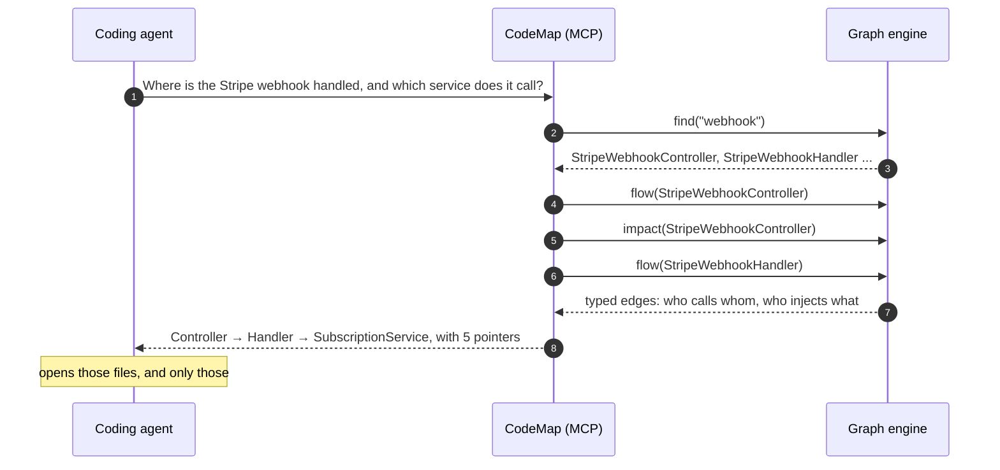

# Graph Theory System Modeling

A method for turning a code base into a typed graph that developers and coding agents **query
instead of reading** — context engineering for code. An agent asks where something lives, gets back
a handful of pointers, and opens only those files. Built on a production system and measured in the
open: the results that went against it are on the [evidence page](docs/EVIDENCE.md).

[**🗺 The graph of a real system**](https://checkitout.app/technical-survey/engineering#graph-topology) ·
[**🎬 90-second film**](https://checkitout.app/codemap) ·
[**🧭 Interactive walkthrough**](https://claude.ai/artifact/GwUEay3qmwnqrANh7yY7pm) ·
[**📊 Quality page**](https://check-it-out-dev.github.io/graph-theory-system-modeling/quality/) ·
[**📖 The story**](docs/STORY.md)

[](https://check-it-out-dev.github.io/graph-theory-system-modeling/)
[](https://github.com/Check-It-Out-Dev/graph-theory-system-modeling/actions/workflows/ci.yml)
[](./LICENSE)

---

## Highlights

- **A method, not a product** — a three-level map (one hub, a navigator per subsystem, the files),
  typed relationships, and navigation clues written for an agent. The same method has been used to
  [generate documentation on demand](GraphTheoryInSystemModeling/04_Living_Documentation_On_Demand_Real_Example.md),
  to [place a new feature](GraphTheoryInSystemModeling/05_Living_Documentation_How_To_Add_Seat_Model_Real_Example.md),
  to keep a debugging agent's knowledge of past bugs, and to index an Angular frontend beside a
  Spring Boot backend ([more examples](#the-method-beyond-the-main-example)).
- **Queryable context instead of a full window** — the agent holds a map and asks for pointers; it
  never receives file contents from the graph. A query touches a few nodes however large the system
  is; reading grows with every file, on every question. What an agent pays end to end is a separate
  question, and it is [measured](docs/EVIDENCE.md).
- **Subsystems found by mathematics, accepted by a test declared in advance** — two independent
  partitions, one from what files say and one from how they change, combined on the partition
  lattice. Accepted because it beat both inputs on unseen history in 18 of 20 splits
  ([the mathematics](docs/MATHEMATICS.md)).
- **A small model trained to navigate, and to abstain** — a 4-billion-parameter model on a plain CPU
  walks the graph through thirteen verbs, and says "not in this graph" instead of inventing a file.
- **Served to coding agents over MCP** — seven tools; pointers, not file dumps.
- **Evaluated in the open, losses included** — an audit of its own mathematics, a campaign in which
  agents with the graph cost *more* than agents with grep, and a gate that fails the build when a
  published number drifts from its artifact ([the evidence](docs/EVIDENCE.md)).
- **Prompts treated as code under test** — a team's conventions prompt measured on real tasks,
  rewritten by GEPA, and refused certification because the gain was not certain
  ([below](#gepa-a-prompt-treated-as-code-under-test)).

## The story

In 2025 I was building a production system with coding agents inside a 200,000-token window. That
is enough to tempt you to read everything and not enough for the system, so every session began by
re-reading the same files and forgot them at the end. The fix was not a bigger window; it was to
stop sending code and send a map.

The map began as notes in the MCP memory server's knowledge graph, moved to Neo4j with one hub node
and six behavioural roles, gained embeddings and reranking as MCP servers, and then a typed algebra
for its edges. The early papers explained it with more mathematics than it had earned. A later audit
and a set of experiments withdrew most of that and kept what survived a test: an unsupervised way to
find subsystems, shipped as an application, served over MCP, and measured — including the night it
lost to grep. The window is five times larger now. The reasons for a map have not gone away: a
model still attends worse to a long context, and every token is paid for on every question.

The whole account, step by step with dates: **[docs/STORY.md](docs/STORY.md)**.

## How an agent uses it

One question, as the served graph answered it on 2026-09-16
([recorded run](applications/CodeMap/eval/judge/runs/events-2026-09-16.jsonl)):


```mermaid
sequenceDiagram
    autonumber
    participant A as Coding agent
    participant C as CodeMap (MCP)
    participant G as Graph engine
    A->>C: Where is the Stripe webhook handled, and which service does it call?
    C->>G: find("webhook")
    G-->>C: StripeWebhookController, StripeWebhookHandler ...
    C->>G: flow(StripeWebhookController)
    C->>G: impact(StripeWebhookController)
    C->>G: flow(StripeWebhookHandler)
    G-->>C: typed edges: who calls whom, who injects what
    C-->>A: Controller → Handler → SubscriptionService, with 5 pointers
    Note over A: opens those files, and only those
```

Four graph steps, five pointers — each a path, a role, a subsystem and a line count — and no file
content. This run used `codemap_ask`: a hosted model inside the server (Claude Sonnet) walked the
graph and wrote the answer, at about 190,000 tokens of mostly cached context. That convenience is
the mode that [lost to grep on cost](docs/EVIDENCE.md#what-went-against-it); the cheap paths are
`codemap_step`, where the agent runs the verbs itself with no model in between, and the local 4B
navigator. The same run, step by step, with the part of the graph it touched:
**[One question, four hops](https://claude.ai/artifact/GwUEay3qmwnqrANh7yY7pm)** (its source is
[`docs/walkthrough/`](docs/walkthrough/one-question-four-hops.html)). Asked about something the graph does not hold ("the Kubernetes operator that scales the
recommendation engine"), the same server answered that it has no pointer to offer.

| | |
| :-- | :-- |
| **The shape** | One `NavigationMaster` → subsystem navigators → one node per file. In the current pack: 1,594 files, 5,573 edges, 92 hyperedges, 34 navigators |
| **Six roles** | Every file is an Actor, a Process, a Rule, an Event, a Context or a Resource |
| **Thirteen verbs** | `map` `enter` `find` `impact` `flow` `seam` `cohort` `spine` `health` `read` `cache`, and the two endings `answer` and `pass` ([the language](applications/CodeMap/docs/03-dsl-interface.md)) |
| **Seven MCP tools** | `codemap_ask` `codemap_step` `codemap_open` `codemap_search` `codemap_feedback` `codemap_miss` `codemap_status` ([the server](applications/CodeMap/remote/README.md)) |

## The mathematics

The part of this repository I care most about getting right, and the part it got wrong first.

- **What runs**: subsystems as a meet on the partition lattice; a type algebra that says which edges
  may exist; typed hyperedges; trophic height for "what stands on what"; the statistics that decide
  what may be claimed.
- **What is only described**: graph colouring for dependency conflicts, the Ramsey argument for six
  roles, the Friendship Theorem for the hub. Papers, not programs; one theorem is false as stated.
- **What was withdrawn**: the magnetic Laplacian as a partitioner, rotations and Berry phase as the
  model of an edge, a published anti-correlation, three ways of fusing embeddings. Each was run and
  retired by a number.

All three lists, with the formulas and the measurements: **[docs/MATHEMATICS.md](docs/MATHEMATICS.md)**.

## Does it help?

Yes for finding things, not yet proven for cost.

- A trained 4B model reaches 0.975 execution accuracy on held-out questions and abstains on
  questions the graph cannot answer.
- At equal content similarity, two files joined by a typed edge are 4 to 9 times likelier to change
  together (14 times pooled over all pairs).
- On 35 paired tasks, agents with the served graph used 1.6 times the tokens of agents with grep.
  They asked a navigator for prose instead of walking the graph, and the comparison that matters
  has not been run yet.

Every result, for and against, with its source: **[docs/EVIDENCE.md](docs/EVIDENCE.md)**. When this
started the window was 200k tokens and a map was the only way to fit a system in it. It is not
perfect, and the open questions are listed there too.

## Similar ideas, and when

This was not first. aider built a repository map in 2023; GraphRAG, Graphiti, LangGraph and the
Model Context Protocol all appeared in 2024; one code graph over MCP was published a month before
this repository's first commit on 2025-09-16. What this repository adds to that line: subsystems
found by mathematics, a navigator that abstains, and an evaluation gate.
LangGraph is the closest famous name and a different thing — a graph of the *agent's* steps, where
this is a graph of the *system* the agent works on.

The comparison, entry by entry with dates and links: **[docs/RELATED-WORK.md](docs/RELATED-WORK.md)**.

## GEPA: a prompt treated as code under test

Every team with coding agents writes a conventions file and hopes. The alternative is to test it.

**What GEPA is.** [GEPA](https://arxiv.org/abs/2507.19457) (Genetic-Pareto, 2025) is an optimiser
for text. It keeps a pool of candidate prompts; each round it runs one on a few tasks, hands the
failures — which rule broke, which test failed, what the judge said — to a reflection model that
rewrites the prompt, and keeps the rewrite only if it does better. Selection is Pareto per task, so
a candidate that is best on one hard task survives beside the one with the best average.

**What was done with it here.** The conventions of a real Spring Boot code base became a manual of
17 checkable rules. A coding agent implemented ten small features under it; each change was built,
run against hidden acceptance tests, checked rule by rule on the diff, and graded by a judge that
never saw the prompt. GEPA rewrote the manual until the gains fell below the noise floor.

**The result.** The rewritten prompt scored higher on tasks the optimiser never saw, and the
interval of that gain still included zero. The rule declared before the run said no, so the original
prompt stayed. The pipeline, the statistics, the judge's calibration and every figure:
**[docs/PROMPT-UNDER-TEST.md](docs/PROMPT-UNDER-TEST.md)**.

## The method beyond the main example

| Applied to | What exists | Status |
| :-- | :-- | :-- |
| Documentation on demand | [Paper 4](GraphTheoryInSystemModeling/04_Living_Documentation_On_Demand_Real_Example.md), [screenshots and the generated document](Real_Example_Documentation_On_Demands_Screenshots_And_Generated_Documentation/) | Real output from the 2025 graph |
| Designing a feature (seat licensing) | [Paper 5](GraphTheoryInSystemModeling/05_Living_Documentation_How_To_Add_Seat_Model_Real_Example.md), [screenshots](Real_Example_New_Feature_Seat_Model_Screenshots/) | One recorded design session |
| A debugging agent's memory of bugs | [`GPT5_ClineDebugger.xml`](Promts/GPT5_ClineDebugger.xml), [`Sonnet4_1M_ErdosDebugger.xml`](Promts/Sonnet4_1M_ErdosDebugger.xml) | Prompt contracts over the MCP memory server |
| An Angular frontend beside the backend | one group of 503 files in the same pack | Served, with recorded answers |
| Curation decisions as data | [ledger](applications/CodeMap/graph/ledger/README.md), [curation report](applications/CodeMap/graph/CURATION_REPORT.md) | Real decisions, kept with their history |
| A team's coding conventions | [`eval/put`](applications/CodeMap/eval/put) | Run on the real backend; not certified |
| Dependency conflicts as graph colouring | [paper](GraphTheoryInSystemModeling/ChromaticNumbersInSystemModeling.md) | Paper only, with a corrected theorem |

## Run it

**CodeMap, locally.** One command boots the graph engine, the local model and a browser UI:

```bash
cd applications/CodeMap
python codemap.py up        # `python codemap.py check` verifies the pack and the model without starting anything
```

Windows users can take the
[installer](https://storage.waw.cloud.ovh.net/v1/AUTH_62ce8c0b4d874faa89fb3e086832f1a6/downloads/codemap/codemap-setup-1.2.0.exe)
(22 MB, checksums beside it; it fetches the model itself). More in the
[application's README](applications/CodeMap/README.md).

**From Claude Code, over MCP.**

```bash
claude mcp add --transport http codemap https://codemap.checkitout.app/mcp \
  --header "Authorization: Bearer $CODEMAP_TOKEN" --header "X-CodeMap-User: owner"
```

The served instance is the owner's; a team runs the same server locally with the graph pack from the
latest Release ([how](applications/CodeMap/remote/README.md)). Security is sized for a small team:
one shared token and a user name in a header. Per-person accounts are out of scope.

**On your own code base.** The agents that index, organise and annotate a code base are in
[`.agents/`](.agents/README.md); the from-scratch path is the
[regeneration runbook](applications/CodeMap/docs/05-regen-runbook.md). The 2025 route on Neo4j
Community Edition is [Paper 3](GraphTheoryInSystemModeling/03_Living_Documentation_How_To_Start_For_Free.md).

## Testing

| What | How it is tested |
| :-- | :-- |
| **The evaluation itself** | 198 checks on every push, in 0.2 s, with no GPU and no model: the prompt's contract with the parser, the scorer's arithmetic, the grammar's verdicts, and every published figure against its artifact — by replaying nine frozen model runs, 4,936 recorded DSL steps ([`eval/ci`](applications/CodeMap/eval/ci)) |
| **The two MCP servers** | 26 pytest tests between them, 22 of which run in CI; the four that load the real model are marked slow and stay out ([embeddings](McpServerForEmbeddings/tests), [reranking](McpServerForReranking/tests)) |
| **The navigator model** | Answers are compared with what the engine executes, never with an opinion about the text ([harness](applications/CodeMap/training/eval_harness.py)) |
| **The served system** | Six synthetic users, a calibrated judge, one artifact per night ([quality page](https://check-it-out-dev.github.io/graph-theory-system-modeling/quality/)) |

Results are public on the [dashboard](https://check-it-out-dev.github.io/graph-theory-system-modeling/).

## Documentation

| | |
| :-- | :-- |
| [docs/STORY.md](docs/STORY.md) | How the method came to be, with dates |
| [docs/MATHEMATICS.md](docs/MATHEMATICS.md) | What runs, what is only described, what was withdrawn |
| [docs/EVIDENCE.md](docs/EVIDENCE.md) | Every result, for and against, and what comes next |
| [docs/RELATED-WORK.md](docs/RELATED-WORK.md) | Similar ideas, with dates |
| [docs/PROMPT-UNDER-TEST.md](docs/PROMPT-UNDER-TEST.md) | The GEPA experiment in full |
| [docs/README.md](docs/README.md) | The index: papers, the application, the agents, the governance cards |

## The rest of the estate

- **[checkitout-backend](https://github.com/Check-It-Out-Dev/checkitout-backend)** — the Spring Boot
  system the graph describes, and the code base the prompt experiment ran on.
- **[checkitout-frontend](https://github.com/Check-It-Out-Dev/checkitout-frontend)** — the Angular
  frontend indexed in the same graph.
- **[checkitout.app/technical-survey](https://checkitout.app/technical-survey/engineering)** — the
  estate in one screen, with the graph drawn from its data.

## Licence, citation, contact

MIT — see [LICENSE](./LICENSE). The tools used in the 2025 research phase are declared in
[AUTHORS_DECLARATION.md](./AUTHORS_DECLARATION.md) and [COMPLIANCE.md](./COMPLIANCE.md).

```bibtex
@misc{marchewka2025living,
  title  = {Living Documentation Through Graph Theory and HoTT},
  author = {Marchewka, Norbert},
  year   = {2025},
  url    = {https://github.com/Check-It-Out-Dev/graph-theory-system-modeling}
}
```

**Norbert Marchewka** · [LinkedIn](https://www.linkedin.com/in/norbert-marchewka-292377129/) ·
norbert_marchewka@checkitout.app. Questions go to public GitHub issues, where the answer helps
everyone; the author does not offer paid consulting on this method. Contributions are welcome and
stay under MIT — language analysers beyond Java, embedding models, query patterns, other graph
databases.
