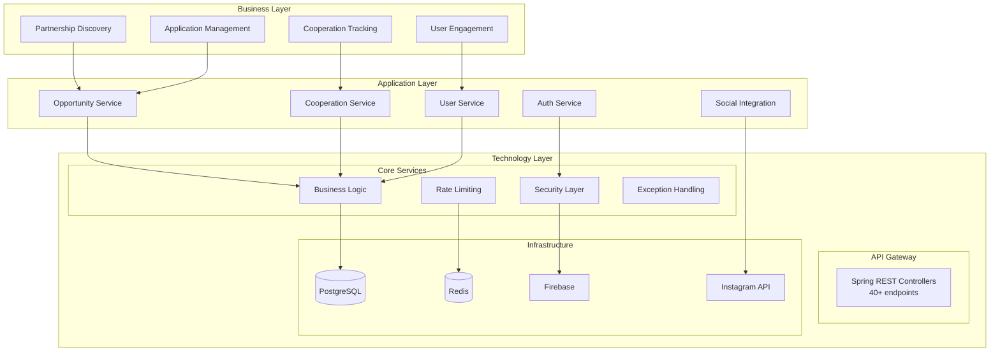
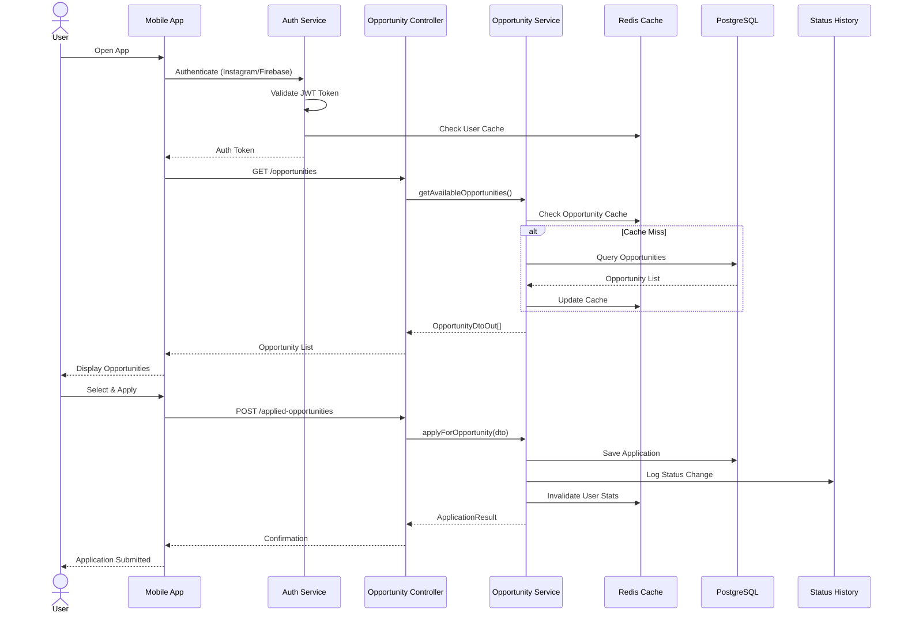
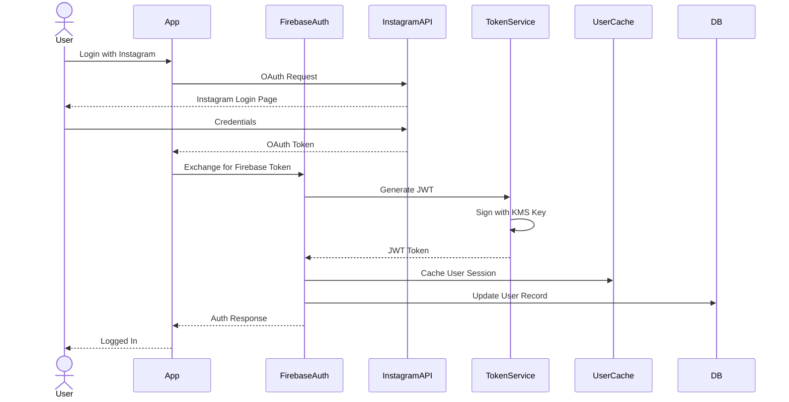
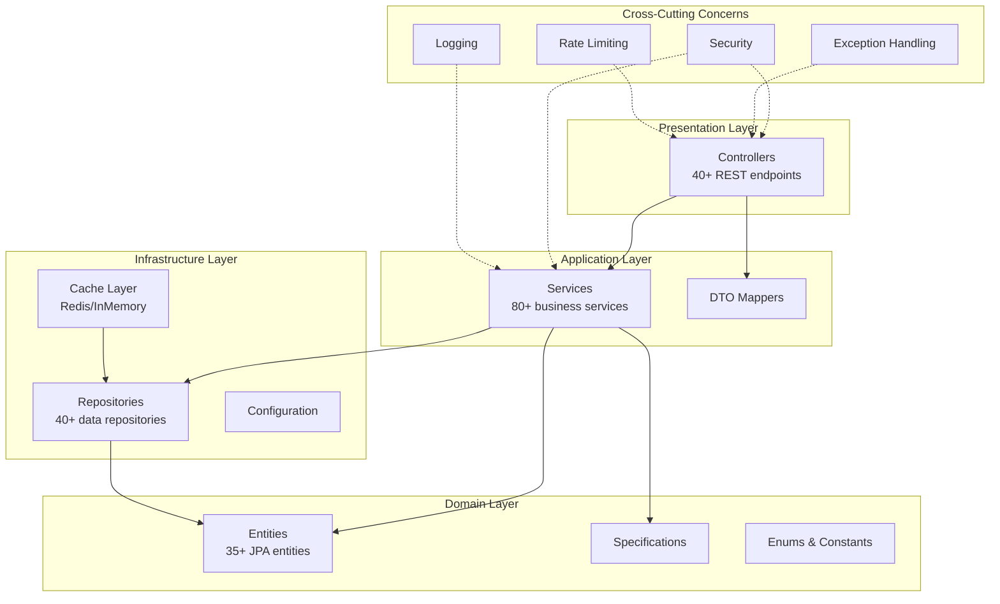
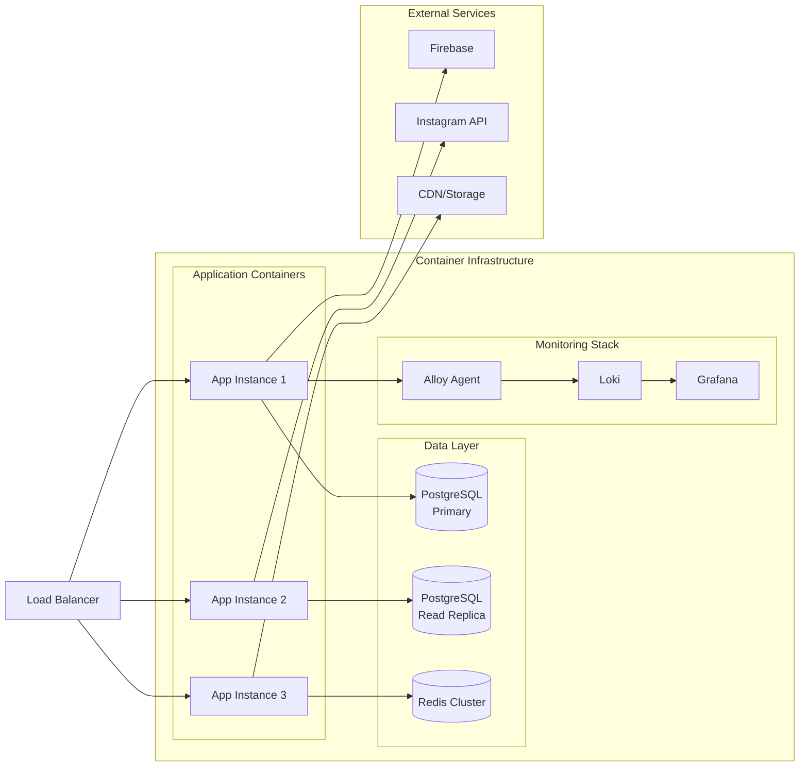

# CheckItOut Platform - System Documentation

## 🎯 Executive Summary

**CheckItOut** is an **Instagram-integrated partnership and collaboration platform** that connects influencers, content creators, and businesses for sponsorship opportunities and collaborative ventures. Built on Spring Boot with a modular architecture, it provides a complete ecosystem for managing partnership lifecycles from discovery to active cooperation.

## 📊 System Overview

```
┌─────────────────────────────────────────────────────────────────┐
│                     CheckItOut Platform v2.0                    │
├─────────────────────────────────────────────────────────────────┤
│  Package: com.sm.instagram.platform                             │
│  Tech Stack: Spring Boot 3.x, PostgreSQL, Redis, Firebase       │
│  Architecture: Modular Monolith (Microservice-Ready)            │
│  Integration: Instagram API, Firebase Auth                      │
└─────────────────────────────────────────────────────────────────┘
```

## 🏛️ System Architecture

### High-Level Architecture (ArchiMate Style)



## 🔧 Subsystem Architecture

### Core Subsystems

```
┌──────────────────────────────────────────────────────────────┐
│                        SUBSYSTEMS                            │
├──────────────────────────────────────────────────────────────┤
│                                                              │
│  ┌──────────────────────────────────────────────────┐        │
│  │ BusinessLogic (PageRank: 0.3)                    │        │
│  │ • Opportunities Management                       │        │
│  │ • Cooperations Tracking                          │        │
│  │ • User Management                                │        │
│  │ • Admin Operations                               │        │
│  │ • Social Sync                                    │        │
│  └──────────────────────────────────────────────────┘        │
│                           │                                  │
│                    DEPENDS ON                                │
│                ┌──────────┴───────────┐                      │
│                ▼                      ▼                      │
│  ┌─────────────────────┐   ┌─────────────────────┐           │
│  │ Security (PR: 0.2)  │   │ RateLimiting (0.1)  │           │
│  │ • JWT Auth          │   │ • Redis-based       │           │
│  │ • Firebase Auth     │   │ • Throttling        │           │
│  │ • 2FA/TOTP          │   │ • API Limits        │           │
│  │ • Session Mgmt      │   │                     │           │
│  └─────────────────────┘   └─────────────────────┘           │
│                                                              │
│  ┌─────────────────────────────────────────────────┐         │
│  │ Infrastructure (PageRank: 0.3)                  │         │
│  │ • Docker Deployment                             │         │
│  │ • CI/CD Pipeline                                │         │
│  │ • Monitoring (Loki/Grafana)                     │         │
│  └─────────────────────────────────────────────────┘         │
│                                                              │
│  ┌─────────────────────────────────────────────────┐         │
│  │ ExceptionHandling (PageRank: 0.1)               │         │
│  │ • Global Exception Handler                      │         │
│  │ • Business Exception Management                 │         │
│  └─────────────────────────────────────────────────┘         │
└──────────────────────────────────────────────────────────────┘
```

## 📦 Module Structure

### Package Organization

```
com.sm.instagram.platform/
├── auth/                        # Authentication & Authorization
│   ├── controller/              # Auth endpoints
│   ├── service/                 # Auth business logic
│   ├── cache/                   # User caching (Redis/InMemory)
│   └── firebase/                # Firebase integration
│
├── appliedopportunities/        # Core Business Domain
│   ├── controller/              # REST endpoints
│   ├── service/                 # Business logic
│   ├── repository/              # Data access
│   ├── dto/                     # Data transfer objects
│   └── domain/                  # Domain entities
│
├── activecooperations/          # Active Partnership Management
│   ├── controller/
│   └── service/
│
├── address/                     # Location Services
│   ├── controller/
│   ├── service/
│   └── geo/                     # GeoIP services
│
├── security/                    # Security Infrastructure
│   ├── jwt/                     # JWT handling
│   ├── ratelimit/              # Rate limiting
│   └── recaptcha/              # Bot protection
│
├── common/                      # Shared Components
│   ├── exception/              # Exception handling
│   ├── validation/             # Input validation
│   └── util/                   # Utilities
│
└── config/                      # Configuration
    ├── redis/                   # Redis config
    ├── firebase/               # Firebase config
    └── security/               # Security config
```

## 🔄 Core Business Flows

### 1. Partnership Opportunity Discovery & Application



### 2. Authentication Flow with Instagram Integration



### 3. Active Cooperation Lifecycle

```
┌──────────────────────────────────────────────────────────────┐
│                  COOPERATION LIFECYCLE                       │
├──────────────────────────────────────────────────────────────┤
│                                                              │
│  [DISCOVERED]                                                │
│       │                                                      │
│       ▼                                                      │
│  [APPLIED] ──────► [REJECTED]                                │
│       │                                                      │
│       ▼                                                      │
│  [UNDER_REVIEW]                                              │
│       │                                                      │
│       ▼                                                      │
│  [NEGOTIATION]                                               │
│       │                                                      │
│       ▼                                                      │
│  [APPROVED]                                                  │
│       │                                                      │
│       ▼                                                      │
│  [ACTIVE_COOPERATION] ◄──────┐                               │
│       │                      │                               │
│       ├──► [ON_HOLD] ────────┘                               │
│       │                                                      │
│       ▼                                                      │
│  [COMPLETED]                                                 │
│       │                                                      │
│       ▼                                                      │
│  [ARCHIVED]                                                  │
│                                                              │
└──────────────────────────────────────────────────────────────┘
```

## 🏗️ Layered Architecture

### Layer Dependencies



## 📊 Data Model Overview

### Core Entities

```
┌─────────────────────────────────────────────────────┐
│                    USER                             │
├─────────────────────────────────────────────────────┤
│ • id: UUID                                          │
│ • instagramId: String                               │
│ • email: String                                     │
│ • userType: INFLUENCER|BUSINESS|ADMIN               │
│ • preferences: UserPreferences                      │
│ • socialConnections: List<UserSocialConnection>     │
└─────────────────────────────────────────────────────┘
           │                            │
           │                            │
           ▼                            ▼
┌─────────────────────┐    ┌────────────────────────────┐
│ PARTNERSHIP         │    │ APPLIED_OPPORTUNITY        │
│ OPPORTUNITY         │    ├──────────────────────────  ┤
├─────────────────────┤    │ • user: User               │
│ • title             │◄───│ • opportunity: Partnership │
│ • description       │    │ • status: OpportunityStatus│
│ • requirements      │    │ • appliedDate: DateTime    │
│ • compensation      │    │ • content: List<Content>   │
│ • photos: List      │    │ • statusHistory: List      │
└─────────────────────┘    └────────────────────────────┘
                                       │
                                       ▼
                            ┌──────────────────────────┐
                            │ ACTIVE_COOPERATION       │
                            ├──────────────────────────┤
                            │ • startDate: DateTime    │
                            │ • endDate: DateTime      │
                            │ • deliverables: List     │
                            │ • performance: Metrics   │
                            └──────────────────────────┘
```

## 🔐 Security Architecture

### Security Layers

```
┌──────────────────────────────────────────────────────────┐
│                    REQUEST FLOW                          │
├──────────────────────────────────────────────────────────┤
│                                                          │
│  [Client Request]                                        │
│        │                                                 │
│        ▼                                                 │
│  [Rate Limiter] ◄─── Redis                               │
│        │                                                 │
│        ▼                                                 │
│  [JWT Filter] ◄─── Token Validation                      │
│        │                                                 │
│        ▼                                                 │
│  [Authentication] ◄─── Firebase/Instagram                │
│        │                                                 │
│        ▼                                                 │
│  [Authorization] ◄─── Role-Based Access                  │
│        │                                                 │
│        ▼                                                 │
│  [2FA Check] ◄─── TOTP/QR Code (if enabled)              │
│        │                                                 │
│        ▼                                                 │
│  [GeoIP Validation] ◄─── Location Verification           │
│        │                                                 │
│        ▼                                                 │
│  [Business Logic]                                        │
│                                                          │
└──────────────────────────────────────────────────────────┘
```

## 🚀 Deployment Architecture

### Infrastructure Overview



## 📈 Performance Metrics

### System Characteristics

```
┌──────────────────────────────────────────────────────┐
│              PERFORMANCE PROFILE                     │
├──────────────────────────────────────────────────────┤
│                                                      │
│  Total Files:           426 Java files               │
│  Controllers:           40+ REST endpoints           │
│  Services:              80+ business services        │
│  Repositories:          40+ data repositories        │
│  DTOs:                 30+ transfer objects          │
│  Entities:              35+ JPA entities             │
│                                                      │
│  Architecture Layers:   5 (clearly separated)        │
│  Subsystems:           5 major subsystems            │
│  Graph Density:        0.667 (well-connected)        │
│  Coupling:             Medium (refactoring needed)   │
│                                                      │
│  Cache Strategy:       Redis + In-Memory fallback    │
│  Auth Methods:         JWT + Firebase + Instagram    │
│  Rate Limiting:        Redis-based per-user/IP       │
│                                                      │
└──────────────────────────────────────────────────────┘
```

## 🔄 Integration Points

### External System Integration

```
┌─────────────────────────────────────────────────────────┐
│                  INTEGRATION MAP                        │
├─────────────────────────────────────────────────────────┤
│                                                         │
│  Instagram API                                          │
│  ├── OAuth Authentication                               │
│  ├── User Profile Sync                                  │
│  ├── Follower Count Updates                             │
│  └── Content Verification                               │
│                                                         │
│  Firebase Services                                      │
│  ├── Authentication                                     │
│  ├── Cloud Firestore (User Documents)                   │
│  ├── Cloud Storage (Media)                              │
│  └── Push Notifications                                 │
│                                                         │
│  Redis Cache                                            │
│  ├── User Session Cache                                 │
│  ├── Rate Limiting Counters                             │
│  ├── Opportunity Cache                                  │
│  └── GeoLocation Cache                                  │
│                                                         │
│  PostgreSQL Database                                    │
│  ├── User Management                                    │
│  ├── Opportunity Storage                                │
│  ├── Application Tracking                               │
│  └── Audit Logs                                         │
│                                                         │
└─────────────────────────────────────────────────────────┘
```

## 🛠️ API Endpoints Overview

### Main Controller Groups

| Controller | Purpose | Key Endpoints |
|------------|---------|---------------|
| **AuthController** | Authentication | POST /auth/login, /auth/refresh, /auth/logout |
| **PartnershipOpportunityController** | Browse opportunities | GET /opportunities, GET /opportunities/{id} |
| **AppliedOpportunityController** | Manage applications | POST /applied-opportunities, GET /my-applications |
| **ActiveCooperationController** | Active partnerships | GET /cooperations, PUT /cooperations/{id}/status |
| **UserController** | User management | GET /users/profile, PUT /users/preferences |
| **UserSocialConnectionController** | Social integration | POST /social/connect, GET /social/stats |
| **AdminController** | Administration | GET /admin/users, POST /admin/approve |

## 🔍 Key Technical Insights

### Discovered Issues & Recommendations

1. **Circular Dependencies in Auth Module**
   - Problem: Auth components have circular references
   - Impact: Tight coupling, difficult testing
   - Solution: Extract AuthenticationFacade interface

2. **High Coupling in FirebaseAuthProxy**
   - Problem: 8 dependencies (should be 4-5 max)
   - Impact: Brittleness, hard to maintain
   - Solution: Apply Dependency Inversion Principle

3. **Missing Service Layer Abstraction**
   - Problem: Some controllers directly access repositories
   - Impact: Business logic leakage
   - Solution: Enforce service layer for all operations

4. **Redis Fallback Strategy**
   - Strength: InMemory cache fallback when Redis unavailable
   - Ensures system resilience

## 📝 Development Guidelines

### Code Organization Standards

```java
// Standard Service Pattern
@Service
@RequiredArgsConstructor
public class OpportunityService {
    private final OpportunityRepository repository;
    private final UserCacheService cacheService;
    private final OpportunityMapper mapper;
    
    @Transactional
    public OpportunityDtoOut applyForOpportunity(OpportunityDtoIn dto) {
        // 1. Validation
        validateApplication(dto);
        
        // 2. Business Logic
        var entity = mapper.toEntity(dto);
        entity.setStatus(OpportunityStatus.APPLIED);
        
        // 3. Persistence
        var saved = repository.save(entity);
        
        // 4. Cache Invalidation
        cacheService.invalidateUserStats(dto.getUserId());
        
        // 5. Return DTO
        return mapper.toDto(saved);
    }
}
```

## 🚦 Getting Started

### Prerequisites
- Java 17+
- PostgreSQL 14+
- Redis 6+
- Firebase Project
- Instagram App Registration

### Environment Variables
```bash
# Database
DB_HOST=localhost
DB_PORT=5432
DB_NAME=checkitout

# Redis
REDIS_HOST=localhost
REDIS_PORT=6379

# Firebase
FIREBASE_PROJECT_ID=your-project
FIREBASE_PRIVATE_KEY=your-key

# Instagram
INSTAGRAM_APP_ID=your-app-id
INSTAGRAM_APP_SECRET=your-secret
```

### Build & Run
```bash
# Build
./mvnw clean package

# Run with profile
./mvnw spring-boot:run -Dspring.profiles.active=dev

# Docker deployment
docker-compose up -d
```

## 📚 Additional Resources

- API Documentation: `/swagger-ui.html`
- Monitoring Dashboard: `http://localhost:3000` (Grafana)
- Health Check: `/actuator/health`
- Metrics: `/actuator/metrics`

---

*Document Version: 2.0.0 | Generated from System Analysis | CheckItOut Platform*