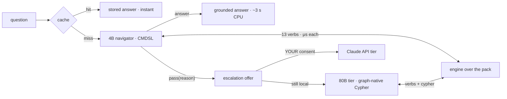

# CodeMap — precomputed understanding, navigated by a small model

**Przenosimy inteligencję z wag modelu do struktury danych.** *We move the intelligence
out of model weights and into the data structure.* A typed code graph with recipes and
navigation metadata is the brain; a small local model (4B, GGUF, plain CPU) is only the
mouth. Ask questions about a 430k-LOC production codebase and get grounded answers in
seconds, offline — from a 2.5 GB model that went from 0% to all-gates-green in one
night of training for ~$25.

CodeMap inverts the usual "send the codebase to a frontier model" pattern:
**understanding is precomputed once into a graph; the model only navigates.** The
navigator speaks a 13-verb DSL over a portable pack (entities, dependency edges,
curated hierarchy, co-change cohorts, AI-authored clues); every verb executes in
microseconds; recurring questions come from a zero-cost cache; and when the local stack
honestly can't answer, it *says so* and offers — with your consent, never without — an
escalation to a Claude API model.



**Two local tiers, one graph.** The trained 4B owns the canonical routes; an
optional untrained big instruct model (Qwen3-Next-80B-A3B auto-detected in
`bin/models/`) is the *graph-native* tier: its prompt teaches how the graph was
built and it queries the pack's LadybugDB in raw read-only Cypher beside the 13
verbs — counting, typed-edge filters, top-k, every shape the DSL cannot say.
Both run on a plain CPU; neither sends a byte anywhere.

## Quickstart

**Windows, no git, no Python:** download ONE file —
[`codemap-setup-1.1.0.exe`](https://storage.waw.cloud.ovh.net/v1/AUTH_62ce8c0b4d874faa89fb3e086832f1a6/downloads/codemap/codemap-setup-1.1.0.exe)
(22 MB) — and run it. It carries the app, the graph pack, embedded Python and
llama.cpp; the 2.5 GB navigator model it downloads itself, SHA-256 verified.
One Start-menu entry later you're asking questions. Offline install: put a
`codemap-lora-r22-q4_k_m.gguf` next to the exe and no download happens. (Build
it yourself anytime: `installer\build_installer.ps1` — see `installer/RELEASE.md`.)

**Any OS, from source:**

```bash
git clone <this repo> && cd codemap
python codemap.py up          # checks runtime, fetches llama.cpp, boots, opens browser
```

That's the whole install. Optional: copy `.env.example` → `.env` and set
`ANTHROPIC_API_KEY` to enable the consent-gated API tier (Claude Sonnet default, Haiku
budget, Opus deep — one adapter, your choice, key never leaves your machine). Without
the 2.5 GB model file the app still runs in cache + map mode; `python codemap.py check`
tells you what's present.

## The measured story (every number on committed artifacts)

| | |
|---|---|
| Round 1 (closed-book SFT) | **0/20** execution-exact — the model invented file names |
| Round 2 (open-book selection) | **0.9545** on 141 never-seen entities |
| Round 2.2 → frozen v1 | **0.9752** exec · abstention **1.0** · false-pass 0.008 |
| CPU, Q4-quantized, grammar-on | **0.9836** — *above* the full-precision GPU run |
| Latency (plain CPU, 30 threads) | step p50 **0.55 s** · answer p50 **2.9 s** |
| Autonomous loop tier | 104 live sessions · 0 stalls · honest abstention with routed advice |

The full write-up — every technique tried vs kept, with the equations (SFT/LoRA/DPO,
grammar-constrained decoding, verifiable rewards, the eval ladder and the instruments
that lied first) — is [`docs/04-training-story.md`](docs/04-training-story.md). The
projected economics for a 5-person team: **$8–32/month vs $126–546/month**
frontier-only — ~90–95% of tokens simply stop being spent, because recurring
understanding is served from precomputed structure instead of re-derived per question.

## What's in the box

| dir | contents |
|---|---|
| `codemap.py` | the wizard: `up` / `check`, auto-fetches the llama.cpp runtime |
| `app/` | engine (13 verbs) · DSL parser + GBNF · server · browser UI · model client · big local tier (graph-native Cypher) · API tier · autonomous-loop evaluator · prompt-transfer + graph-native benches · 34-check suite |
| `graph/` | the pack (entities/edges/hierarchy/clues/golds) · vocabulary grammar (regenerates with every export) · the agent operating manuals (HypatiaV5, GrothendieckV5, ErdosNavigator, Conductor) with append-only learnings ledgers |
| `training/` | full pipeline: open-book corpus generator (invariant-gated) · Modal SFT/DPO/GGUF · eval harness with embedding + reranker judges · `FREEZE-v1.md` |
| `eval/` | 104 gold questions with execution fingerprints, PL/EN aliases |
| `docs/` | design docs 00–06 (project, stage 0, runtime, DSL, training story, regeneration runbook, prompt-transfer findings) |

Model file: `bin/models/codemap-lora-r22-q4_k_m.gguf` (sha16 `9c454526d7d0d1b0`) —
distributed separately from git (2.5 GB); the wizard verifies and instructs.

## Links

- **Windows installer** (one 22 MB file — app + pack + Python + llama.cpp;
  the model is fetched by the wizard, SHA-256 verified; hosted on OVH Object
  Storage):
  <https://storage.waw.cloud.ovh.net/v1/AUTH_62ce8c0b4d874faa89fb3e086832f1a6/downloads/codemap/codemap-setup-1.1.0.exe>
  — `SHA256SUMS.txt` sits at the same path (`installer/RELEASE.md` is the runbook)
- **92-second demo film** (re-shot 2026-09-03 with the graph-native 80B scene):
  `[VIMEO_DEMO_URL]` *(placeholder — hosted on Vimeo, embedded
  in the live checkItOut demo page)*
- **Live demo page ("AI and CodeMap")**: <https://checkitout.app/> *(the hosted
  checkItOut frontend, the convergence point of the triad)*
- **Research foundation**: **graph-theory-system-modeling** — the NavigationMaster
  pattern, v4 partition, tri-lens embeddings, hyperedges; the mathematics this app
  embodies. This repo ships inside it at `applications/CodeMap/`.

Authoring database: **LadybugDB (MIT)** end to end — `graph/authoring/` holds the store,
the one-time Neo4j migrator (provenance), and the four dialect laws; the runtime pack is
its export. No copyleft-licensed component anywhere in the stack.

## Honesty registers

Answers cite what the graph holds; the navigator abstains rather than invent — the
grammar makes invented names *unrepresentable*, training made wrong-but-real selection
rare, and both are measured, not assumed. Known ambers are documented, not hidden:
long-answer p95 latency, loop-tier bare-start abstention 0.74. The API tier never fires
without an explicit click. Nic nie wysyłamy bez Twojej zgody.
