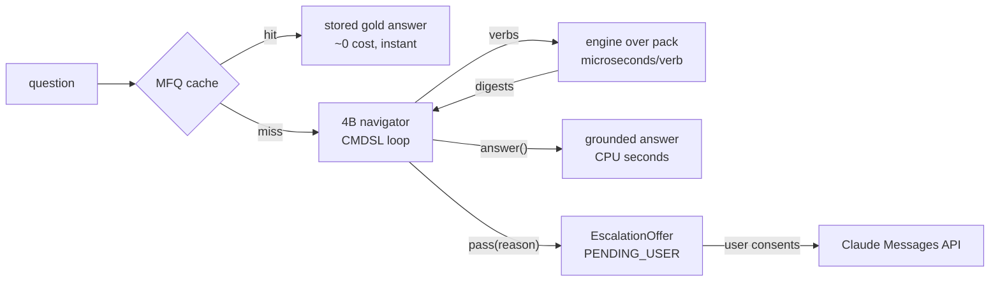
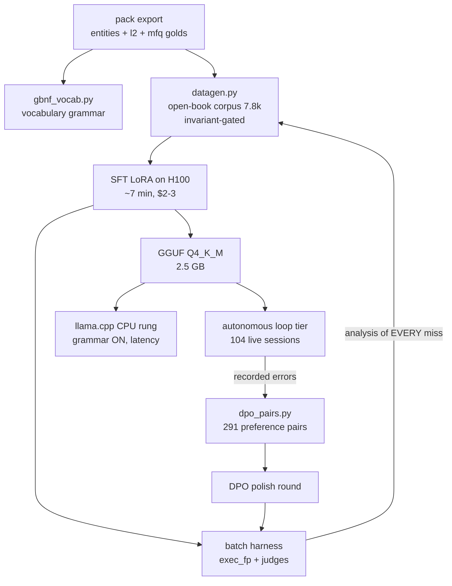

# CodeMap — how the small navigator was trained

*An educational write-up of the CodeMap model training, 2 September 2026. Every number in this
document was measured on committed artifacts; every technique is marked TRIED, KEPT, or
CONSIDERED-NOT-NEEDED. This is the story of getting a 4B model on a laptop CPU to answer
codebase questions at close to frontier quality — by refusing to make the model smart.*

---

## 1. The thesis: move the intelligence out of the model

The classical approach to "AI that understands your codebase" sends the codebase (or its
embeddings) to a frontier model and asks it to *understand on every question*. That
understanding is recomputed, billed per token, and forgotten — thousands of times per month.

CodeMap inverts this. **Understanding is precomputed once and stored in a graph; answering is
navigation, not comprehension.** The stack:

- **The graph** (Neo4j at authoring time → portable pack → embedded LadybugDB at runtime) holds
  entities, dependency edges, a curated three-level hierarchy (master → group/leaf navigators →
  files), hyperedge cohorts, trophic heights (a layering score borrowed from food-web analysis),
  and AI-authored navigation clues.
- **The MCP/engine** exposes exactly 13 verbs (CMDSL) over that graph. Every verb is a
  deterministic dictionary lookup: microseconds, no tokens.
- **The model** — Qwen3-4B, LoRA-tuned, Q4-quantized, 2.5 GB — does ONE job: translate a human
  question into a short CMDSL program and narrate the results. It is a **router and translator**,
  not an oracle.
- **The cache** (the MFQ tier, for most-frequent questions) serves recurring questions with no
  model involvement.
- **The API tier** (Claude, behind explicit user consent) exists for the questions the local stack
  honestly declines.



Why this shape wins for a small model: the hard part of code Q&A is *knowing the codebase*, and
a 4B model cannot durably know 430k lines of code. It does not need to; the pack knows. The model
only needs the *vocabulary* (13 verbs) and the *protocol* (where to look next, when to stop, when
to abstain). Those are learnable from thousands of examples, not billions.

## 2. The language: CMDSL, with grammar as a hard constraint

The model's entire action space is one expression per turn:

```
map() enter(sub) find(term) impact(entity[,depth]) flow(entity[,depth])
seam(a,b) cohort(entity) spine(sub) health(kind) read(entity)
cache(q) answer(text) pass(reason)
```

Two decode-time constraints make this safe:

**Syntax constraint (GBNF).** llama.cpp grammars constrain sampling: at each step the sampler
zeroes the probability of every token that cannot extend a valid parse. Formally, with grammar G
and generated prefix y<t, the next-token distribution is

    p̃(y_t | y_<t, x) ∝ p_θ(y_t | y_<t, x) · 𝟙[ y_<t · y_t extendable in L(G) ]

**Vocabulary constraint.** Our grammar's terminals are not generic identifiers; they are the
pack's actual vocabulary: 1,413 entity names, 30 routable subsystem ids, 2 health kinds
(`graph/pack/codemap_vocab.gbnf`, regenerated automatically on every pack export). Inventing a
nonexistent file name is not "discouraged"; it is **unrepresentable**.

Measured caveat (section 6): the grammar removes *invention*, not wrong *selection*. A wrong but
real name is still grammatical, so selection had to be trained. Measured on-distribution, the
grammar's accuracy dividend was **zero** and its latency cost was **zero**. It ships as a free
insurance floor for out-of-distribution inputs, which is exactly what an adversarial user
supplies.

## 3. The theory, per technique

### 3.1 SFT — supervised fine-tuning (KEPT, but only open-book)

The base objective is next-token negative log-likelihood on (prompt x, target y):

    L_SFT(θ) = − Σ_t log p_θ(y_t | x, y_<t)

**Round 1 (TRIED, FAILED, kept as the control):** 386 closed-book pairs
("question → impact(ExactName.java)"). Result: 100% syntactically valid CMDSL, 93.2% token
accuracy, and **0/20 execution-exact** on held-out questions. The model invented plausible names
(`HttpInterceptor.java`). This is the documented *Knowing–Using Gap* (arXiv 2607.08393): SFT on
narrow corpora amplifies verbatim memorisation (arXiv 2510.16022). The weights memorised the
training names and failed to route that memory into use. **The number to trust is execution
accuracy, never token accuracy.**

**Round 2 (KEPT — the single biggest lever):** every entity argument became a COPY, not a
recall. If the exact name is verbatim in the question → the direct verb. Otherwise → open with a
free-text `find(term-from-question)`, then select the exact name FROM the result. Every training
pair satisfies the machine-checked **open-book invariant**: an entity or subsystem argument in the
target must appear in the pair's visible context. Data generation *fails the build* if any pair
violates it (it caught 6 on its first run: stale subsystem ids and a truncated map digest). Result:
execution accuracy 0/20 → **0.9545**, on 141 entities held out of training entirely. The skill that
generalises is *selection from context*, which is independent of the entity.

Evidence base for the design: copy/pointer mechanisms for entity-consistent generation
(2604.18170, 2210.03273); open-book beating closed-book recall is the semantic-parsing default
(schema linking as a trained subtask, Schema-R1 2506.11986).

### 3.2 LoRA — low-rank adaptation (KEPT)

Full fine-tuning of a 4B model is unnecessary for a narrow vocabulary. LoRA freezes W₀ and learns
a low-rank residual:

    W = W₀ + (α/r)·B·A,   B ∈ ℝ^{d×r}, A ∈ ℝ^{r×k}, r ≪ min(d,k)

We use r = 16, α = 32, dropout 0.05 on all attention and MLP projections, bf16, no QLoRA
(document 00, D10: quantize at deployment, not at training). Practical numbers: about 0.7% of the
weights are trainable; a full round on 7.8k pairs takes **about 7 minutes on one H100, about
$2–3**. That cheap loop is itself a technique: it made five full train-measure-diagnose cycles in
one night affordable.

### 3.3 Injective supervision (KEPT — a data rule, not an architecture)

Round 2's residual misses were 7 out of 9 *supervision defects*: the same question surface
supervised two different targets ("X.component" → both the `.ts` and the `.html` sibling;
depth-2 drills phrased identically to depth-1). The rule: **one question surface, one defensible
target**. Sibling-stem families get full-name questions; optional arguments must be signalled in
words ("2 hops"). Formally: supervision must be a *function* from prompt to target; if it is a
relation, the argmax learner is punished for a correct guess. The fix moved execution accuracy
0.9545 → **0.9794**.

### 3.4 Abstention — selective prediction as policy (KEPT, the subtle one)

`pass(reason)` is a first-class trained skill (the selective-prediction, risk–coverage framing).
Two measured lessons:

1. **Emptiness is an answer** (the owner's insight): 120 execution-verified null pairs ("Nothing
   depends on X — zero incoming dependencies") teach that empty ≠ fail. Without them a model
   learns "every question has content", which is hallucination pressure by construction (the
   SQuAD 2.0 unanswerable-questions lesson).
2. **Abstention is a policy, not a capability.** Round 2.1 trained two protocols side by side
   (immediate pass for some unanswerables, gather-then-pass for others), with classes
   indistinguishable from the surface. Measured abstention: 0.42. Unifying to ONE policy —
   *always gather evidence first, then decide* — plus 4× oversampling of the pass class (0.8% of
   the data) took it to **0.9091 (GPU) / 1.0 (CPU)** with a false-pass rate of 0.0083 (in both
   cases the model abstaining *early* on blatant nonsense, the harmless direction). The model learns
   whichever protocol is consistent; an inconsistent one is unlearnable.

### 3.5 DPO — direct preference optimisation (KEPT as polish, round 4)

SFT has no notion of "don't". DPO trains on (prompt x, chosen y_w, rejected y_l):

    L_DPO = − E [ log σ( β·( log π_θ(y_w|x)/π_ref(y_w|x) − log π_θ(y_l|x)/π_ref(y_l|x) ) ) ]

It provably optimises the same objective as RLHF with a Bradley–Terry reward, without a reward
model or PPO. Our pairs cost nothing: **rejected = the model's own recorded errors** (premature
answers in the loop tier, wrong bare-start abstentions, batch misses) plus mechanical corruptions
of the three *measured* failure classes (sibling swap, wrong selection from context — the class
the grammar cannot catch — and find-when-verbatim). 291 pairs, β = 0.1, learning rate 5e-6, LoRA
on the merged SFT model with the reference implemented as adapters-off (no second model in
memory). Guard rails: step rows ONLY; the preference loss never touches `answer()` prose
(small-model degeneration and a reward-hacking surface); the execution and answer gates must not
regress, or the round is rejected.

### 3.6 GRPO / RL with verifiable rewards (CONSIDERED — the gate never fired)

Our executor is a perfect verifiable reward: exact result-fingerprint match, no learned judge, no
reward hacking. The plan (SLM-SQL 2507.22478, the Arctic-Text2SQL-R1 recipes, Modal's official
GRPO example) was staged behind a gate: *only if SFT execution accuracy < 0.85*. SFT reached
0.9752, so the gate never fired. The lesson worth teaching: **RL is the expensive lever you earn
the right to skip by fixing your data.** It remains the designed round 5 if a future corpus
(multiple repositories, new verbs) reopens the gap. Known traps catalogued for that day: TRL
GRPO + vLLM + LoRA colocation hangs (TRL #3671, #2698) → server mode or generate fallback; pin a
separate image and never touch the frozen SFT stack.

### 3.7 The judges — measuring "same answer" without a human

| gate | mechanism | what it catches |
|---|---|---|
| `exec_fp` | run BOTH programs through the engine; compare the canonical result SHA | the ground-truth gate: deterministic, cannot be gamed |
| `ans_cos` | Qwen3-Embedding-8B cosine (on Modal, proven deterministic) | semantic drift in prose answers |
| `rr_equiv` | reranker score(q, model_ans) ≥ 0.9 × score(q, gold_ans) | gold-equivalence as a retrieval judge |
| `topo_arch` | the nearest gold in embedding space must share the ARCHETYPE | an answer sitting in the wrong *region* even when fluent |
| `risk_cov` | pass rate on unanswerable versus answerable strata | abstention calibration, in both directions |

The archetype detail is a lesson in itself: `topo_arch` was first implemented as self-retrieval
and silently broke on templated null answers (12 near-identical "nothing depends on X" golds).
The instrument was fixed to its stated design: class retrieval for templated families,
self-retrieval for unique golds.

### 3.8 The evaluation ladder, and the instruments that failed first

```
rung 0      teacher + engine            = ceiling
rung 0.5    scripted replay             = harness proof (must be 1.0 — it was)
rung 2      trained model, batch, GPU   = learning measurement
rung 2-CPU  Q4 GGUF + llama.cpp         = the SHIPPING configuration
rung LOOP   autonomous multi-step       = the product path (protocol skills)
```

Three separate times in one night **the instrument failed before the model did**: a diagnostic
reporting "0 drift" because it shared the defect it was measuring; a topology metric drifting from
its own docstring; a loop referee comparing fingerprints from two different universes (0.0 by
construction). A rule we learned three times over: *identical implementations only confirm shared
assumptions. Independent implementations are the control, and a clean reading from an instrument
that shares the system's assumption is a blind spot, not a verdict.*

## 4. The training pipeline, end to end



The loop that mattered was not the training loop but the **miss-analysis loop**: every round's
misses were individually classified (model error, supervision defect, or instrument defect)
before any next lever was chosen. Four of the five "model failures" across the night were
actually *our* failures, found because the harness stored enough to replay every miss
deterministically.

## 5. The journey (all committed, all reproducible)

| round | corpus | change | exec_fp (held-out) | abstention |
|---|---|---|---|---|
| r1 | 386 closed-book | baseline SFT | **0.00** | — |
| r2 | 7,532 open-book | selection, not recall | **0.9545** | 0.33 |
| r2.1 | 7,813 | injective drills, nulls, 2-step negatives | **0.9794** | 0.42 |
| r2.2 | 7,776 (+pass ×4) | ONE abstention policy, spine drills, gold repair | **0.9752** | **0.91 / 1.0 CPU** |
| CPU Q4 + grammar | — | the shipping artifact | **0.9752–0.9836** | 1.0 |
| loop tier (first measurement) | — | autonomous sessions | 0.5692 strict* | 0.74 bare-start |

*Strict loop success conflates memorisation on train-split golds with protocol skills the batch
harness cannot see (answer timing, bare-start abstention); its misses seeded the DPO round. In
production this path sits behind the MFQ cache.

Latency on a plain CPU (30 threads, Q4): navigation step p50 **0.55 s**, full answer p50
**2.92 s**, answer p95 10.2 s (over the 5 s target on long answers; the token budget and streaming
are the named levers). Total GPU spend for the whole arc: **about $25**.

## 6. Economics — the five-person team projection

Assumptions (stated, adjustable): a team of 5 (2 developers, a tester, a designer, a manager)
working ON this codebase of about 430k lines; each asks the assistant about *structure* (where is
X, what breaks if, how do I onboard, who talks to whom), say **8 such questions per person per
working day**, 21 working days → **840 questions per month**. Industry telemetry and our own MFQ
mining agree that the distribution is heavy-tailed: the same onboarding, impact and where-is
questions recur constantly. Assume conservatively a **60% cache-hit rate after the first weeks**
(104 curated golds already cover the mined recurring set).

**Frontier-only baseline.** An agentic frontier call that actually reads code before answering
consumes about 50–200k input and 1–3k output tokens (multi-step tool use). At Claude Sonnet rates
($3/M in, $15/M out) that is **$0.15–0.65 per question** → **$126–546 per month**, with a latency
of 15–60 s per answer, and the code leaves the machine on every question.

**CodeMap hybrid.**
- 60% cache tier: about 0 tokens, about 0 s, $0.
- About 35% local navigator: 0 tokens billed, CPU seconds, $0 marginal.
- About 5% honest escalations (42 per month) at the same $0.15–0.65 → **$6–27 per month**.
- Fixed costs: pack refresh on reindex (embedding plus authoring, about $2–5 per month
  amortised); one-time training of about $25.

**Projected steady state: $8–32 per month versus $126–546 per month, a 10–20× reduction**, with
p50 answers in seconds, offline operation, and code that leaves the machine only on consented
escalations. Token effectiveness has the same shape: about 1.3M frontier tokens per month are
replaced by about 60–130k escalation tokens. **Roughly 90–95% of the tokens simply stop being
spent**, because recurring understanding is served from precomputed structure instead of being
re-derived by a frontier model each time. (All four numbers scale linearly with team size and
question rate; the cache fraction *rises* with team size, since question overlap grows.)

## 7. The API tier and the model policy (design position, 2 September)

Escalation is model-directed and user-gated: the navigator's `pass(reason)`, or the runtime's
loop-health signals (stall, invalid output, backtracking), create an **EscalationOffer**
`{offer_id, reason_category, context, suggested_tier: "api", status: PENDING_USER}`; the UI
renders a consent card; nothing is sent anywhere without a click. Reason categories route
differently: `needs-content-read` is the strong API candidate (a frontier model with file access
finishes what the graph pinned down); `ambiguous` should *clarify, not escalate*; `out-of-corpus`
should say "escalation likely wasted" out loud.

**Model policy: one adapter, one default, a string-configurable choice.** The Messages API
adapter is model-agnostic. Supporting "many models" costs nothing at the transport layer and
everything at the feature layer. So: ship v1 with **Claude Sonnet (`claude-sonnet-5`) as the
promoted default** (the best cost/quality for code Q&A), **Haiku 4.5** as the visible budget
option, and an Opus-class model selectable for the deepest architecture questions, all through ONE
code path and a model string in the configuration. What we deliberately do NOT build: per-model
prompts, per-model feature flags, per-model UX. More models as *strings* is free; more models as
*cases* is the complexity trap. The user chooses; the default is opinionated; the escalation
prompt is identical for all.

## 8. What to take from this write-up

1. Put understanding in a structure; make the model a translator into a tiny DSL.
2. Supervise COPY, not recall, and machine-check the open-book invariant.
3. Make invalid outputs unrepresentable (grammar), then measure that dividend honestly.
4. Teach emptiness and abstention as first-class answers; pick ONE abstention policy.
5. Trust only execution-verified metrics; treat token accuracy as decoration.
6. Analyse every miss before choosing the next lever; most "model failures" are supervision or
   instrument failures.
7. Keep the train-measure loop under ten minutes and ten dollars; iteration speed is a technique.
8. Stage RL behind a gate you hope never fires; DPO from recorded errors is the cheap sharpener.
9. Never duplicate an implementation you depend on for truth; independence is the control.
