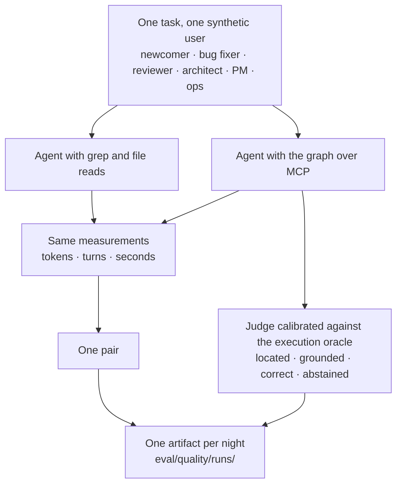

# Does it help? The evidence, both ways

A method for helping coding agents should be judged the way it asks agents to be judged: on
measurements, with the losing results kept. This page lists what has been measured about the graph,
for and against, where each number lives, and what has not been measured at all.

Numbers marked **gated** are tied to a committed artifact by the claims gate
([`applications/CodeMap/eval/ci`](../applications/CodeMap/eval/ci)): the build fails if the text and
the artifact disagree. Numbers marked *ungated* are declared so, with the reason, in the same gate.

## How a comparison is run

## What holds

| Result | Numbers | Source | Gate |
| :-- | :-- | :-- | :-- |
| **A small model can be trained to navigate the graph.** Four rounds of training on execution-checked data | Execution accuracy 0 → 0.9545 → 0.9794 → **0.9752** (the frozen build) on 276 held-out rows, 141 of them about entities never seen in training | [`training/PIPELINE.md`](../applications/CodeMap/training/PIPELINE.md), [training story](../applications/CodeMap/docs/04-training-story.md) | *ungated* — the 2.5 GB checkpoint is not in git |
| **It knows what it does not know.** Questions with no answer in the graph end in `pass`, not in an invented file | Abstention 0.91 on the GPU build, 1.0 on the shipped CPU build | same | *ungated* |
| **The prompt alone moves an untrained model, a little.** The same graph and verbs given to an open 30B model with no training | Route success 0.031 → 0.092 → 0.169 → 0.246 as the prompt gains an output grammar, a Cypher analogy and awareness of its step budget | [`06-prompt-transfer-findings.md`](../applications/CodeMap/docs/06-prompt-transfer-findings.md) | **gated**, 26 claims |
| **Answers do not depend on the database.** The graph engine was replaced (Neo4j → an embedded MIT engine) | 104 gold answers identical byte for byte on both | [`ErdosNavigatorV5.md`](../applications/CodeMap/graph/prompts/ErdosNavigatorV5.md), [runbook](../applications/CodeMap/docs/05-regen-runbook.md) | *ungated* |
| **Typed edges know something the text does not.** Pairs of files with and without a typed edge between them | At equal content similarity, co-change 3.6 to 8.8 times likelier with the edge (14 times pooled); 21.7 times the base rate inside a typed hyperedge | [mathematics §1.6](MATHEMATICS.md#16-what-a-typed-edge-is-worth) | experiment scripts |
| **The subsystem partition beats both of its inputs on unseen history** | 18 of 20 held-out splits, against two baselines, bar declared before the run | [mathematics §1.1](MATHEMATICS.md#11-subsystems-as-a-meet-on-the-partition-lattice) | experiment scripts |
| **Served answers point at real files.** Six synthetic users verify each pointer in their own checkout | Grounded 0.91 and correct 0.74 on night 2026-09-16; 0.94 and 0.90 on night 2026-09-20 | [model card](../applications/CodeMap/MODEL_CARD.md), [evaluation card](../applications/CodeMap/EVAL_CARD.md) | **gated** per night |
| **A hop on the graph is small.** Three questions answered by hand both ways | 1.1 KB of tool output against 26.9 KB of naive grep (2.2 KB refined); one impact query, 4.7 KB with 50 typed dependents, against 9.5 KB of grep paths | [history](../applications/CodeMap/docs/history/08-success-story.md) | *ungated*, three questions |

## What went against it

| Result | Numbers | Source | What it means |
| :-- | :-- | :-- | :-- |
| **Agents with the served graph cost more than agents with grep.** 35 paired conversations, same user, same task | The graph arm used 1.6 times the tokens, 3.5 more turns and 88.5 seconds longer; it was cheaper in tokens in 17 % of pairs | [`campaign.json`](../applications/CodeMap/eval/quality/runs/campaign.json), [history](../applications/CodeMap/docs/history/08-success-story.md) — turns and seconds **gated** | The night's log holds 166 calls to the tool that returns a prose answer and none to the tool that walks the graph. The pairs measured an agent consulting a navigator, not an agent using a graph. The "graph versus grep" claim was withdrawn the next day; the page carrying it is kept under a banner that says so |
| **A manual that made an agent cheaper also made it worse.** The architecture manual on five problems, one run each | Tokens 0.42 and time 0.59 of the general agent's — and a blind judge preferred the general agent on all five: 3.0 against 4.2 overall | [`erdos/runs`](../applications/CodeMap/eval/erdos/runs/2026-09-17.report.md), decision D-R24 in [governance](../applications/CodeMap/docs/07-ai-quality-governance.md) | Recorded as "an efficiency win and a quality loss". Optimising the manual with GEPA raised its training score 0.776 → 0.871; that figure is in-sample and the run was stopped |
| **The optimised conventions prompt was not certified** | Better on held-out tasks, 0.902 → 0.965; the interval of the gain includes zero | [full report](PROMPT-UNDER-TEST.md) — **gated**, 30 claims | The seed prompt stays. The rule was set before the run |
| **Walking the graph predicts co-change worse than reading the files** | AUC 0.62 for two hops on the graph, 0.82 for content similarity, over 20 splits | [mathematics §1.6](MATHEMATICS.md#16-what-a-typed-edge-is-worth) | The graph is a precise signal on few pairs, not a ranker |
| **The judge is not stable from night to night** | κ 0.84 on 29 rows one night; −0.28 on 11 rephrased rows the next; later nights pass only on the second agreement measure | [evaluation card](../applications/CodeMap/EVAL_CARD.md) | A night that fails calibration is recorded as uncalibrated and nothing rests on it |
| **The 2025 papers' gains have no artifact** | "Hallucinations 35 % → 9 %", "productivity +30–40 %", "onboarding in days" | [audit §1.6](../GraphTheoryInSystemModeling/V3/V3_ResearchAudit_2026-09.md) | One informal pilot: fifty tasks, one system, one rater. Not a measurement; the papers are labelled |

## What has not been measured

- **An agent that walks the graph itself, against grep.** The designed use — `codemap_step` calls,
  pointers, then reading only those files — has not been compared end to end. The one campaign that
  ran measured the other tool.
- **A public benchmark.** No SWE-bench or GraphRAG-Bench run; the questions are this code base's own.
- **Another code base, another language.** One Spring Boot backend and one Angular frontend.
- **A person's time.** No study with developers; the synthetic users' own estimate of minutes saved
  was contradicted by the clock and is not reported.

## Present, and what comes next

Dated 2026-09. ✅ built · 🟡 under way · ⬜ designed.

| | What | Detail |
| :-- | :-- | :-- |
| ✅ | **Prompts as contracts** | 20 prompt contracts across five generations; an agent has a specification, so its output has something to be measured against |
| ✅ | **Execution-fingerprint oracles** | The evaluation ladder compares answers with execution, not with a judge's opinion of the text; gold answers are identical across two graph engines |
| ✅ | **Abstention as a tested property** | The navigator abstains on out-of-graph questions — an oracle that knows the boundary of its knowledge is one you can write assertions against |
| ✅ | **Training with its own evaluation** | Four rounds of supervised and preference training, the harness and the data generators in [`training/`](../applications/CodeMap/training/) |
| ✅ | **Prompt and model evaluation as a CI gate** | On every push, with no GPU and no model: the master prompt's verb table must equal the parser's in both directions, the frozen model runs must re-score to their own published summaries, the recorded steps must draw the same verdicts from today's grammar, and every evaluation figure in the prose is tied to the artifact behind it — [`eval/ci/README.md`](../applications/CodeMap/eval/ci/README.md) says why that is the half that rots |
| ✅ | **A conventions prompt under test** | The pipeline built and run end to end on a self-hosted runner, the judge calibrated and revised, GEPA to its plateau; the first candidate was not certified, and [the report](PROMPT-UNDER-TEST.md) says why |
| ⬜ | **The model itself back in the loop** | Re-running the navigator on a schedule needs the 2.5 GB checkpoint and the graph pack published; a publishing decision, not a CI one |
| 🟡 | **Measuring the quality of an AI system in production** | Live since 2026-09-16 on the served MCP: grounded, correct and abstention rates from a judge calibrated against the execution oracle (κ 0.84), ratings from synthetic users who verify pointers — one artifact per night in `applications/CodeMap/eval/quality/runs/`, the [quality page](https://check-it-out-dev.github.io/graph-theory-system-modeling/quality/) and public dashboards. Later nights met the pair count, but the pairs exercised the navigator rather than the graph (see above), so the row stays open |
| ⬜ | **Graph walked by the agent, against grep** | The comparison the first campaign did not make |
| ⬜ | **A second certification and the PR-reviewer prompt** | New held-out tasks declared before the run; the same pipeline over the CI reviewer's prompt |
| ⬜ | **More languages** | The indexing agents are Java-first; TypeScript is the next corpus |

Back to the [README](../Readme.md) · [the mathematics](MATHEMATICS.md) · [the story](STORY.md) ·
[documentation index](README.md)
