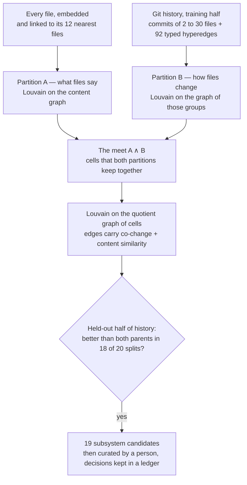

# The mathematics: what runs, what is only described, what was withdrawn

This repository uses a fair amount of mathematics, and it has been wrong about some of it. The early
papers present proofs, definitions and analogies in the same format; a later
[audit](../GraphTheoryInSystemModeling/V3/V3_ResearchAudit_2026-09.md) separated them, and the
experiments that followed retired several constructions by measurement. This page keeps the three
kinds apart: what is implemented and runs, what is written in a paper and nothing more, and what
was tried, measured and withdrawn.

One rule produced the "runs" list. Every candidate was scored against a label nobody chose — which
files change together in git history — on commits it had not seen, against a bar written down before
the run. The losers stayed in the record with the number that beat them.

## How the subsystems are found

The question is practical: given 1,374 files, which belong together? An agent that can name the
subsystem a file lives in reads ten files instead of two hundred.



## 1. What runs

### 1.1 Subsystems as a meet on the partition lattice

The promoted method ("meet-quotient v2", code in
[`meet_merge.py`](../GraphTheoryInSystemModeling/V3/experiments/meet_merge.py) and
[`promote_champion.py`](../GraphTheoryInSystemModeling/V3/experiments/promote_champion.py), write-up in
[§6s](../GraphTheoryInSystemModeling/V3/V3_MathematicalFoundations.md)).

Two partitions of the same files are built from independent evidence. $A$ comes from what the files
*say*: cosine nearest neighbours of their embeddings, clustered with Louvain. $B$ comes from how they
*change*: each commit in the training half of history is a group of files, joined by 92 hyperedges
read off the typed graph, and those groups are clustered.

Partitions of a set form a lattice, and the **meet** $A \wedge B$ is the coarsest partition that
refines both. Its cells are the sets of files that both views keep together:

```math
\mathrm{cell}(i) = \big(A(i),\, B(i)\big)
```

Every agreement between the two views survives in a cell; every disagreement is now a question
about which cells to join. That question is answered on the **quotient graph**, whose vertices are
the cells and whose edges carry both kinds of evidence, each scaled to its maximum:

```math
w(c_1, c_2) = \frac{T(c_1, c_2)}{\max T} + \alpha \, \frac{C(c_1, c_2)}{\max C}, \qquad \alpha = 1
```

where $T$ counts training-half co-changes between two cells and $C$ sums content-graph weight between
them. Louvain runs on the cells, and its resolution is bisected until the number of parts equals
$|A|$, so the result is compared with its parents at the same granularity. No final cluster ever
splits a cell.

| | Held-out modularity | Paired wins over 20 splits |
| :-- | --: | --: |
| Content partition alone (the previous champion) | 0.3555 | — |
| Clustering the training history alone (the ablation) | 0.3402 | 7 / 20 against the champion |
| **Meet-quotient v2** | **0.3738** | **18 / 20** against the champion, **18 / 20** against the ablation |

The bar was written before the run: at least 18 paired wins of 20 random half-and-half splits of
the commit history, against the champion *and* against the ablation (sign test $p \approx 2\times10^{-4}$
each). The second condition matters as much as the first: the method consumes training history, so
it has to beat "just cluster the training history" or the meet contributed nothing.

The cost is stated with the result. The new clusters are more balanced and individually less
precise: files in the same cluster are 3.47 times likelier to change together than files in
different ones, against 5.72 for the old champion. Modularity was the registered criterion;
coherence is the price.

Fitted on all commits, the method gives 19 candidate subsystems from 136 cells. A person then
splits, merges and names them — the decisions are in
[`CURATION_REPORT.md`](../applications/CodeMap/graph/CURATION_REPORT.md) and the
[ledger](../applications/CodeMap/graph/ledger/README.md). The mathematics proposes; it does not have
the last word.

### 1.2 A type algebra for the edges

The graph is typed: every file has one of six roles (Actor, Process, Rule, Event, Context, Resource)
and every behavioural edge one of 17 types — `PERFORMS` from an Actor to a Process, `CALLS` between
Processes, `USES` and `MODIFIES` from a Process to a Resource, `TRIGGERS` from a Process to an Event,
and so on — beside five structural ones (imports, inheritance, injection, tests).

[`HypatiaBasis.md`](../GraphTheoryInSystemModeling/V3/HypatiaBasis.md) writes this down as a quiver
$\mathcal{Q}$ and its path algebra with relations,

```math
\mathcal{H} = k\mathcal{Q} \,/\, (\mathcal{I}_{\text{select}} + \mathcal{J}^3), \qquad \dim \mathcal{H} = 6 + 17 + 43 = 66
```

six vertices, seventeen arrows and the 43 two-step paths that are allowed to exist. Eleven
**selection rules** forbid whole blocks of edges: nothing points at an Actor, a Resource points at
nothing, an Event does not point at an Event. Order matters almost everywhere: for 38 of the 43
compositions the reverse path does not exist at all, two pairs exist both ways and land in
different places, and three commute.

What that buys in practice: the indexing agent may only write edges the algebra allows, and edges
that break a rule are recorded instead of dropped — the shipped graph carries 198 of them, all
injection edges, and a gold question asks for them by name. The audit confirms the algebra itself
is correct. What it is not: a checker in code. The rules are enforced through the indexing agent's
instructions, not by a program in this repository.

### 1.3 Typed hyperedges and commit groups

An edge joins two files; many real couplings join several. Three typed patterns are emitted as
hyperedges ([`emit_hyperedges.py`](../embeddings-service/emit_hyperedges.py)): the Processes that
use or modify one Resource, the Actors that perform one Process, and Actors that reach one Resource
through a Process. Each is weighted by how unusual its hub is,

```math
\mathrm{idf} = \max\big(0,\ \ln(N_{\text{hubs}} / k_{\text{satellites}})\big)
```

There are 92 in the shipped graph. Files inside one hyperedge change together 68.4 % of the time,
against a base rate of 3.15 % — a factor of 21.7. They are precise and sparse, which is why they
serve as evidence inside the partition and as the `cohort` verb an agent can call, not as a ranker.

### 1.4 Which way is down: trophic height

A navigation clue should say what a file stands on. Ecologists have the tool: a food web's trophic
level. Take the directed graph $A$ of all dependency edges inside one subsystem (the seventeen kinds,
imports and injections included), with in- and out-degrees $d_{\text{in}}, d_{\text{out}}$, and solve

```math
\big(\mathrm{diag}(d_{\text{in}} + d_{\text{out}}) - A - A^{\top}\big)\, h = d_{\text{in}} - d_{\text{out}}
```

on each connected component and shift so the lowest file has height zero
([`c1_dossiers.py`](../applications/CodeMap/graph/scripts/c1_dossiers.py)). Edges point from caller
to callee and each call adds a level, so entry points sit at the bottom and the things everyone
depends on at the top. A controller that comes out *above* its services is reported as an inversion
worth a look ([`c3_organisation.py`](../applications/CodeMap/graph/scripts/c3_organisation.py)).

### 1.5 The judge of every partition: held-out co-change

Two files edited in the same commit are coupled in a way nobody selected to flatter the method
([`cochange_eval.py`](../GraphTheoryInSystemModeling/V3/experiments/cochange_eval.py)). The details
decide whether the number means anything: pairs are scored within one repository only (files in
different repositories can never co-change, and every predictor implicitly knows the repository);
commits touching more than 30 files are dropped; each commit carries total weight one.

Beside held-out modularity and coherence, the standard measures of the software-clustering
literature are reported — TurboMQ, MoJoFM, adjusted Rand index, normalised mutual information, the
map equation ([`standard_metrics.py`](../GraphTheoryInSystemModeling/V3/experiments/evidence/standard_metrics.py),
[`resolution_limit.py`](../GraphTheoryInSystemModeling/V3/experiments/evidence/resolution_limit.py)) —
with their failures: MoJoFM went negative on this data and is not allowed to carry a comparison
alone.

### 1.6 What a typed edge is worth

Does the graph know anything the text does not? Predicting co-change over 20 splits:

| Predictor | Mean AUC |
| :-- | --: |
| Content embedding similarity | 0.8212 |
| Graph, two hops | 0.6211 |
| Same directory | 0.5975 |
| Graph, one hop | 0.5320 |

Reading the files beats walking the graph, clearly. The graph's contribution is elsewhere. Hold
content similarity fixed and compare pairs with and without a typed edge: within each of the five
similarity deciles where edges occur, the pairs with an edge co-change 3.6 to 8.8 times as often
(pooled over all pairs: 0.286 against 0.020, a factor of 14). The edges are a strong signal that covers 0.57 % of pairs. That is the honest summary of
the whole programme: **content finds the neighbourhood; typed structure says something content
cannot, on the few pairs where it speaks.**

One geometric result survived its null test. Project each relation separately with FastRP
(dimension 8, the embedding as node feature) and take each relation's deviation from the common
projection. The deviations of `MODIFIES` and `CALLS` are opposed, cosine −0.459, and permuting the
edge labels while keeping the topology moves the statistic to +0.239 ± 0.027. The types carry the
effect, not the sparsity. The audit's caveats stand: one pair, 29 files, five permutations.

### 1.7 Retrieval

A question is embedded (Qwen3-Embedding-8B), the 40 nearest files come from a vector index, and a
cross-encoder (Qwen3-Reranker-8B) orders the top ten
([`v3_retrieve.py`](../embeddings-service/v3_retrieve.py); the two models are also served as MCP
servers in [`McpServerForEmbeddings/`](../McpServerForEmbeddings/) and
[`McpServerForReranking/`](../McpServerForReranking/)). For predicting co-change, fusing the content
ranking with a lexical one by reciprocal rank fusion gave the best ranker on record, AUC 0.8432.

### 1.8 Statistics that decide what may be claimed

The evaluation side has its own mathematics ([`METRICS.md`](../applications/CodeMap/eval/put/METRICS.md),
[`put_stats.py`](../applications/CodeMap/eval/put/put_stats.py)):

- **Wilson intervals** for pass rates. A rule counts as reliably followed only when the lower bound
  of the 95 % interval reaches 0.90 — which takes 35 runs without a failure.
- **A noise floor** below which no difference is called a gain:
  $`\delta = \max\big(\delta_{\text{judge}},\ 1.96 \cdot s \cdot \sqrt{2/(T k)}\big)`$, with $s$ the pooled
  standard deviation over $k$ replicates on $T$ tasks and $\delta_{\text{judge}}$ the judge's own
  test-retest difference.
- **A paired bootstrap** over tasks and replicates (10,000 resamples) for the certification interval,
  with an exact sign test beside it.
- **Agreement measures** for the LLM judge against reference grades: Cohen's κ, Gwet's AC1 (which
  stays meaningful when almost everything is a pass), Spearman's ρ.

These are the reason the [prompt experiment](PROMPT-UNDER-TEST.md) ends in "not certified": the gain
was twice the noise floor and its interval still included zero.

## 2. Described in the papers, not implemented

Kept as written, each with a status line at its top. None of this runs in the repository.

| Idea | Where | Status |
| :-- | :-- | :-- |
| Maven dependency conflicts as graph colouring | [`ChromaticNumbersInSystemModeling.md`](../GraphTheoryInSystemModeling/ChromaticNumbersInSystemModeling.md) | Theorem 2.2 is false in general — the minimum number of exclusions is $n - \alpha(G)$, not $\chi(G) - 1$. It becomes true when every conflict component is a clique, which real class conflicts are (audit §1.3) |
| Six behavioural roles from $R(3,3) = 6$ | [Paper 2](../GraphTheoryInSystemModeling/02_Living_Documentation_Deep_Modeling.md) | An observation on the case study presented as a proof; a conjecture (audit §1.2). The shipped graph uses a different six: Actor, Process, Rule, Event, Context, Resource |
| Hub navigation from the Friendship Theorem | [Paper 1](../GraphTheoryInSystemModeling/01_Living_Documentation_HoTT_Graph_Theory.md) | Motivation only. The three-level hierarchy is justified today by what it does: one entry point, a subsystem index, then files |
| Clustering by homotopy type theory | [Paper 1](../GraphTheoryInSystemModeling/01_Living_Documentation_HoTT_Graph_Theory.md) | The vocabulary of the 2025 pilot; no implementation. The partition that runs is §1.1 |
| "Erdős–Lagrangian unification" | [`ErdosLagrangianUnification.md`](../GraphTheoryInSystemModeling/ErdosLagrangianUnification.md) | Theorem 3.1 is the definition read backwards for a constant Lagrangian (audit §1.2) |
| Attention complexity $O(n^2) \to O(\lvert E \rvert d)$ | [Appendix A](../GraphTheoryInSystemModeling/Appendix_A_Mathematical_Bridge.md) | Describes masked sparse attention, which a graph in a prompt does not provide. What survives is the retrieval claim: fewer tokens need to be sent (audit §1.2) |
| Information Lensing as learned metric | [Appendix C](../GraphTheoryInSystemModeling/Appendix_C_Information_Lensing.md) | Its bounds are correct and it carries its own correction table; the learned transform is not built. The MCP servers use the name for instruction-conditioned embeddings |

## 3. Tried, measured, withdrawn

Each of these was implemented, run and retired by a number. The scripts are kept under
[`experiments/archive/`](../GraphTheoryInSystemModeling/V3/experiments/CATALOG.md) and
[`experiments/evidence/`](../GraphTheoryInSystemModeling/V3/experiments/CATALOG.md) so the result can
be reproduced.

| Construction | What the measurement said |
| :-- | :-- |
| Per-relation weights $\alpha_k$ as "real versus virtual" topologies | They track edge count: $r = -0.82$ against $\log(\text{edges})$. A sparsity statistic |
| An anti-correlation of −0.311 between two relations as proof of non-commutativity | Does not reproduce with real embeddings: every pair is positive, 0.67 to 0.95 |
| The magnetic Laplacian as a partitioner | Shatters the graph: 857 fragments, modularity 0.054, 0 wins of 20 |
| Rotations as the model of an edge, with Berry phase, holonomy and curvature built on them | A one-parameter scalar beats the rotation on all 34 edge signatures |
| An "orientation obstruction" | A conditioning artefact: the sign of the determinant is a coin flip under resampling |
| A sheaf Laplacian | No global sections; its low spectrum ranks hubs |
| A composite embedding in $\mathbb{R}^{136}$ | AUC 0.603 against 0.844 for the content embedding it was built from |
| Fusing three embedding "lenses" | 0 wins of 20 under two fusion rules |
| A 42-invariant structural lens, PageRank and betweenness included | AUC 0.565; any weight on it hurts |
| Consensus clustering of two strong partitions | Unstable in resolution: 13 parts at resolution 2.531, 190 at 2.750; 4 wins of 20 |

The lessons that outlasted the constructions are in the
[topical map](../GraphTheoryInSystemModeling/V3/V3_MathematicalFoundations.md) at the top of the
foundations document: score against a label nobody chose, match granularity before comparing, keep
an ablation that could embarrass you, and never report one split.

## References

Blondel et al., [Fast unfolding of communities in large networks](https://arxiv.org/abs/0803.0476)
(Louvain, 2008) · Traag, Waltman, van Eck, [From Louvain to Leiden](https://www.nature.com/articles/s41598-019-41695-z)
(2019) · Chen et al., [Fast and Accurate Network Embeddings via Very Sparse Random Projection](https://arxiv.org/abs/1908.11512)
(FastRP, 2019) · Fanuel, Alaíz, Suykens, [Magnetic eigenmaps for community detection in directed networks](https://arxiv.org/abs/1606.07359)
(2017) · Rosvall, Bergstrom, [the map equation](https://www.mapequation.org/) (2008) · MacKay, Johnson,
Sansom, [How directed is a directed network?](https://arxiv.org/abs/2001.05173) (trophic levels, 2020).

Back to the [README](../Readme.md) · [the story](STORY.md) · [the evidence](EVIDENCE.md) ·
[documentation index](README.md)
