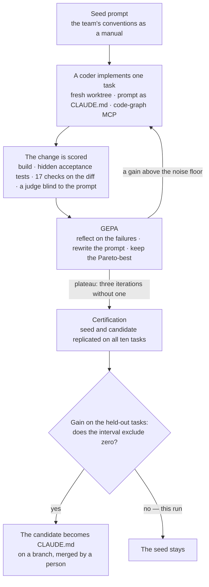

# A conventions prompt under test: how to make sure AI will not turn your code base into spaghetti

This page is the full report of one experiment: a conventions prompt for a coding agent, treated as
code under test — measured on real tasks, improved by GEPA against the measurement, and put through a
certification on tasks the optimiser never saw. It did not pass, and the page says why. The short
version is in the [README](../Readme.md#gepa-a-prompt-treated-as-code-under-test); the method is
[`applications/CodeMap/docs/09-prompt-under-test.md`](../applications/CodeMap/docs/09-prompt-under-test.md).

Every figure below is tied to a committed artifact by the claims gate
([`applications/CodeMap/eval/ci`](../applications/CodeMap/eval/ci)): edit a number here without the
artifact behind it and the build fails.

## The problem

Every coding agent brings its own habits. Put five of them on one code base — or one agent across five
sessions — and the code base collects five ways to inject a dependency, three ways to send a notification and
a scheduled job that runs on every instance at once. Each change works on the day it is written; the cost arrives
later, when nobody can predict where anything is. Most teams answer with a conventions file for the agent
(`CLAUDE.md`, `AGENTS.md`, a rules folder) and hope. This page is the other answer: **treat the conventions prompt
as code under test** — declare what "following the conventions" means, measure it on real tasks, improve the
prompt against the measurement, and ship it only when it wins on tasks it never saw.

The case study is the backend of checkItOut (Spring Boot, Java 21). Its written conventions are clear
(CONTRIBUTING, the architecture guide, the test guides), and the code base follows them only in part: 7 of 38
entities carry `@Version`, 9 of 23 `@Scheduled` methods a lock, and 69 fields are still `@Autowired`. That is why
every check below looks at **the agent's diff**, never at the tree: an agent that imitates its neighbours would
otherwise be graded as compliant.

## Prompt evaluation — the pipeline and the math



The same pipeline, exactly as the code runs it:

```
instance = (prompt vN, 10 tasks with hidden tests, contract.json: rule -> check, judge rubric, weights)
   for each (prompt, task, replicate):
   fresh worktree -> claude -p (Sonnet coder, prompt as CLAUDE.md, code-graph MCP) -> diff + tool trace
   -> build, the agent's own tests, hidden acceptance tests, pass-to-pass tests
   -> 17 deterministic checks on the diff and the trace  +  an Opus judge blind to the prompt
   -> score S = sum of w_i * m_i
GEPA over the prompt (6 training tasks) until the plateau rule stops it
certification: seed x3 and candidate x4 on all 10 tasks -> the hold-out verdict -> CLAUDE.md on a branch
```

| Element | Its role |
| :-- | :-- |
| **The prompt under test** | A conventions manual in XML, one `<rule id>` per convention, rendered with a checksum so a run can prove the model read all of it |
| **Tasks** | Ten small real features at one commit of the backend — a nightly job, an after-commit notification, a vendor behind a port, an endpoint, a schema change — six for training, four held out and never shown to the optimiser. Each has a card the agent sees and **hidden acceptance tests** it never sees (fail on the base commit, pass on a hand-written reference, both proven twice) |
| **The contract** | Every rule the prompt states has a deterministic predicate over the agent's diff or tool trace; a unit test fails when a rule has no check |
| **Runner** | One fresh git worktree per run, `claude -p` on the Claude Code subscription, a Bash allowlist, an output-token budget that ends a runaway session |
| **Checks** | 17 rules — graph first, example read before the first edit, feature packages, constructor injection, after-commit listeners, scheduler locks, ports and adapters, translatable errors, Liquibase changesets, optimistic locking, guarded endpoints, DTO naming, unit tests, build, scope, one pass — each proven on a fixture that breaks it |
| **Judge** | Claude Opus grades correctness, convention fit, design fit (the anti-spaghetti score), test quality and graph use on a 1–5 rubric; it sees the team's rules and the unchanged code the diff touches, never the prompt being tested |
| **Score** | S = Σ wᵢ·mᵢ: hidden tests 0.30, convention checks 0.15, own tests 0.10, process 0.10, judge 0.35 |
| **Noise floor δ** | δ = max(the judge's test-retest MAD, 1.96 · pooled SD of replicates · √(2 / (T·k))): no gain smaller than δ is called a gain |
| **GEPA** | Evolves the prompt (below); stops when three iterations in a row gain no more than δ |
| **Certification** | The seed and the candidate replicated on all ten tasks; the verdict rests on the four held-out tasks only |
| **Promotion** | Only a certified winner becomes the repository's `CLAUDE.md`, on a branch, merged by a person |
| **Evidence** | Every campaign is a GitHub Actions run on a self-hosted runner, its artifacts committed in `eval/put/runs/`, its gauges on a [public dashboard](https://checkitoutapp.grafana.net/public-dashboards/f568734955de418b87a802ffbb562b49) |

**GEPA in plain terms.** GEPA keeps a pool of candidate prompts, starting from the seed. Each iteration takes three
training tasks, runs the current candidate on them, and collects feedback text: which rules failed, which hidden
tests failed, the judge's reasons with code names masked. A reflection model (Claude Opus) reads only that
behaviour-level feedback and rewrites the manual; a guard refuses a rewrite that quotes identifiers from the hidden
tests or the reference solutions, drops a rule or grows past 24,000 characters. The rewrite enters the pool only if
it beats its parent on those three tasks, and then it is scored on all six. Selection is Pareto per task, so a
candidate that is best on one hard task survives beside the one with the best average. What our objective adds to
stock GEPA: deterministic per-rule checks in the feedback, a judge that never sees the prompt, δ as the acceptance
floor, and a ceiling test that turns "the prompt cannot teach this rule" into a recommendation for a CI check.

The statistics — Wilson intervals per rule (a rule is **obligatory** only when its lower bound reaches 0.90, which
takes at least 35 runs without a failure), the paired bootstrap over held-out tasks, the sign test, and the
judge-agreement measures — are in [`eval/put/METRICS.md`](../applications/CodeMap/eval/put/METRICS.md); the design and
decision log is D-R29 onwards in [`docs/07-ai-quality-governance.md`](../applications/CodeMap/docs/07-ai-quality-governance.md),
the method in [`docs/09-prompt-under-test.md`](../applications/CodeMap/docs/09-prompt-under-test.md).

## Criteria for a conventions prompt

The criteria are the contract of the instance; for another prompt only the criteria and the example tasks change,
the pipeline stays. For this one:

| Criterion | Measured by | Weight |
| :-- | :-- | :-- |
| The task is done | hidden acceptance tests passed (0 if the build fails) | 0.30 |
| The conventions are followed | the deterministic checks that apply to the task, on the agent's diff | 0.15 |
| The change comes with tests | a new `*UnitTest`, no Spring context, at most three mocks, compiles and passes | 0.10 |
| The agent works the team's way | the graph queried before the first edit; an existing example read before writing a new kind of class | 0.10 |
| Convention fit, design fit, correctness, test quality, graph use | the judge, 1–5 each; the first three it shares with a person were calibrated against reference grades, correctness and graph use sit beside deterministic signals (hidden tests, graph first) | 0.35 |

With this repository's earlier graph-navigation evaluation (the Erdős architecture manual) only the criteria and the
examples change: answers graded against the execution oracle instead of diffs graded against conventions.

## Calibrating the judge — checking its scores against our own

A third of the score comes from an LLM judge, so the judge is graded before its numbers are used. Scores should be
set and calibrated by people on example tasks; the pipeline's job is to make that cheap and honest:

1. **Anchors with bad changes in them.** A sample of real runs across the judge's range, plus deliberately degraded
   variants (field injection, a missing lock, a service importing its adapter, a listener inside the transaction).
   A good prompt writes good code; without bad anchors, agreement says nothing about whether the judge catches bad code.
2. **Blind re-grading.** A reviewer grades the same changes on the same rubric, without seeing the judge's scores.
3. **Comparison.** Exact agreement, agreement at the ≥ 4 line with its prevalence, κ, Gwet's AC1, Spearman, and for
   every disagreement whether the judge's own second pass closes it (noise) or repeats it (bias).
4. **Adjudication.** Every gap argued on the code: the judge was wrong, the reviewer was, or it is taste.
5. **Revision, only when it pays** — for a pattern that repeats and steers the optimisation; then re-measure
   everything, and stop before the anchors become the rubric's training data.

Here the review found the judge **systematically soft on design**: it praised a new method that duplicated an
existing one (it saw only the diff, never the code the diff repeats), and it rated an unlocked job running on every
instance as a mild smell. Rubric r5 gives the judge the unchanged text of the files a change modifies and names those
patterns. Re-measured on the same twelve anchors, design-fit agreement went from 0.58 to 0.92 exact
(Spearman 0.65 → 0.97) and the judge's own test-retest noise fell (MAD of score 0.017 → 0.009). Not everything
improved: pooled agreement at the ≥ 4 line slipped (AC1 0.90 → 0.85), because three cells now sit on the other side
of the line — two of them flip back on the judge's own second pass, and on the third (a service importing its
adapter) the judge counts the broken rule and still gives 4, which the deterministic ports check fails regardless.
r5 was frozen there: a third revision fitted to the same twelve anchors would make them the rubric's training data.
The record, gap by gap, is in
[`eval/put/judge/reference-scores.json`](../applications/CodeMap/eval/put/judge/reference-scores.json).

## Two prompts

Two prompts can be evaluated this way: the coding agent's, and the PR reviewer in CI that checks conventions on every
pull request. Both should be — the judge first, because an uncalibrated judge turns every later number into its own
opinion. Here we take the coding agent; the reviewer is the same pipeline with different rules and tasks
([`instances/pr-reviewer/contract.json`](../applications/CodeMap/eval/put/instances/pr-reviewer/contract.json)) and is
not run.

## Results

**The seed** is the team's CONTRIBUTING transcribed into the manual format, not tuned. It was already strong: every
seed run built and passed every hidden acceptance test, and the conventions that apply to each task held almost
everywhere. Its one real gap was tests — the agent wrote a new unit-test class in 18 of 30 seed runs.

**GEPA** went from 0.917 → 0.979 on the training tasks in four candidates and stopped on the plateau rule (54 coding
runs, 77 minutes). The reflector wrote behaviour, not task knowledge: a "Check:" line under every rule that the agent
runs on its own diff, a unit-test standard, and a self-review step before the end.

**Certification** — the seed three times and the candidate four times on all ten tasks:

| | seed v1 | GEPA candidate |
| :-- | --: | --: |
| training tasks (in-sample, best-of-k) | 0.907 | 0.970 |
| hold-out tasks (never seen by GEPA) | 0.902 | 0.965 |

**The verdict is no.** The hold-out gain is 0.063 (95 % CI −0.007 to 0.135; δ 0.030): twice the noise floor, but the
interval — over four held-out tasks — does not exclude zero, and that was the rule declared before the run. The gain
is where the seed was weak (two hold-out tasks rose by about 0.15 and 0.11 because the agent now writes tests:
`tests_written` 18/30 → 37/40) and it is flat or slightly negative where the seed was already at the ceiling (one of
four candidate runs failed a hidden test on the notification task). The candidate also cost something: a manual twice
as long, and one run that widened its scope because a new rule sends the agent into every mapper of a changed DTO.
The promotion gate stayed closed and the seed remains the team's prompt; adding replicates after seeing an interval
that just misses would be optional stopping, so a second certification needs new held-out tasks declared first.

**What the rules say.** Obligatory for the candidate over 40 runs (lower Wilson bound ≥ 0.90): graph first, feature
packages, constructor injection, the build, one pass. Below the bound — *rules the prompt could not teach to that
standard*, recommended to enforcement instead: an example read before a new class (a session hook), a new unit test
with every main change (a CI gate), and scope (a diff path gate). The task-specific rules (locks, listeners, ports,
changesets, guards) held in every run that touched them, but 8 to 12 runs per rule cannot reach the 0.90 bound, so
they are reported with their intervals, not claimed. Every figure and run is in
[`eval/put/RUNS.md`](../applications/CodeMap/eval/put/RUNS.md).

## What this does not show

- **The training gain is in-sample and best-of-k.** Only the held-out figure is a claim, and four held-out tasks give
  a wide interval (the sign test cannot reach 0.05 with four tasks; the bootstrap interval is the primary figure).
- **Synthetic tasks, one code base.** Ten small features in one Spring Boot repository, at one commit.
- **One model family.** The coder is Claude Sonnet, the judge and the reflector Claude Opus, on a subscription, dated
  September 2026; a model change is a new measurement. The calibration reviewer is the same family as the judge,
  which inflates agreement where they share a blind spot.
- **The judge is an LLM.** Calibrated on twelve anchors with repeatability measured, not proven on a rare kind of
  defect the anchors do not contain.
- **δ is a floor, not a variance model.**
- **Graph versus no graph is out of scope.** The code graph is one rule of the manual here, not the thing measured.
- **The PR-reviewer prompt is described, not run.**

Back to the [README](../Readme.md) · [documentation index](README.md)
