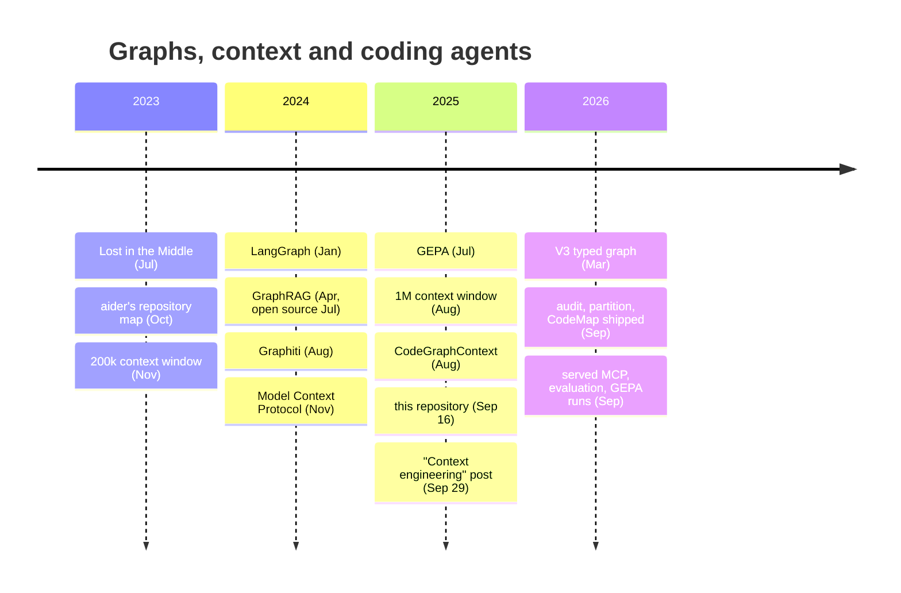

# Related work: what is similar, and when each appeared

This method did not appear in a vacuum, and it was not first at most of what it uses. This page puts
it on one timeline with the ideas it resembles, says plainly what it shares with each and where it
differs, and gives a date and a link for every entry so the order can be checked.

## The neighbours

| When | What appeared | What it shares with this method | Where this method differs |
| :-- | :-- | :-- | :-- |
| 2023-07 | [Lost in the Middle](https://arxiv.org/abs/2307.03172) (Liu et al.) | The problem statement: a model uses the middle of a long context worse than its ends | — it is the reason, not a competitor. See also [Context Rot](https://www.trychroma.com/research/context-rot) (2025) |
| 2023-10-22 | [aider's repository map](https://aider.chat/2023/10/22/repomap.html) | A code base turned into a graph (files and symbols from tree-sitter), ranked, and fitted into a token budget so the agent sees structure instead of every file | aider's map is rebuilt per request and pushed *into* the prompt. Here the graph is persistent, typed and queried *by* the agent, with subsystems and navigation clues computed ahead of time |
| 2023-11-21 | [Claude 2.1, 200k tokens](https://www.anthropic.com/news/claude-2-1) | The window this work was designed against: large enough to tempt you to read everything, small enough that a real code base does not fit | — |
| 2024-01 | [LangGraph](https://github.com/langchain-ai/langgraph) (first release on [PyPI](https://pypi.org/project/langgraph/#history); 1.0 in [October 2025](https://blog.langchain.com/langchain-langgraph-1dot0/)) | Structure made explicit as a graph, state machines as data, checkpointed state outside the model | LangGraph is a graph of the *agent's control flow*: nodes are steps, edges are transitions. This is a graph of the *system the agent works on*. They answer different questions and compose: a LangGraph agent could call this graph as a tool |
| 2024-04-24 | [GraphRAG](https://arxiv.org/abs/2404.16130) (Microsoft; [open source](https://github.com/microsoft/graphrag) 2024-07) | A knowledge graph, community detection over it, and a summary per community so that "global" questions have somewhere to land — the same shape as subsystems with navigation clues | GraphRAG extracts its graph from prose with an LLM. A code graph's edges are parsed, typed and checkable, and the partition here was held to a bar written down before it was run ([mathematics](MATHEMATICS.md)) |
| 2024-05 | [HippoRAG](https://arxiv.org/abs/2405.14831) | Retrieval as a walk on a graph instead of a nearest-neighbour lookup | Text passages there, code entities here |
| 2024-08 | [Graphiti](https://github.com/getzep/graphiti) (Zep; [paper](https://arxiv.org/abs/2501.13956) 2025-01) | Agent memory kept outside the context window as a graph, with time on the edges | Graphiti remembers *conversations and facts about a user*. This remembers *a code base*; the two are complementary |
| 2024-11-25 | [Model Context Protocol](https://www.anthropic.com/news/model-context-protocol), with a reference [knowledge-graph memory server](https://github.com/modelcontextprotocol/servers/tree/main/src/memory); [Neo4j's MCP servers](https://github.com/neo4j-contrib/mcp-neo4j) from 2024-12 | The transport. The first graph an agent queried in this work was that memory server, before Neo4j replaced it ([the story](STORY.md)) | — |
| 2025-07 | [GEPA](https://arxiv.org/abs/2507.19457) (Agrawal et al.; [code](https://github.com/gepa-ai/gepa)) | The optimiser used here on two prompts | Used as published, with a stricter objective around it: deterministic checks, a blind judge, a noise floor, a hold-out verdict ([report](PROMPT-UNDER-TEST.md)) |
| 2025-08-12 | [1M-token context](https://www.anthropic.com/news/1m-context) | Removes the hard limit this work started from | It does not remove the reason: attention still degrades with length and every token is paid for on every question. The window became a reservoir, not a budget |
| 2025-08-16 | [CodeGraphContext](https://github.com/CodeGraphContext/CodeGraphContext) | The closest neighbour: code indexed into a graph database and served to assistants over MCP | A general indexer for many languages. This repository goes narrower and deeper: one stack, subsystems found by mathematics, a trained navigator that abstains, and an evaluation gate |
| **2025-09-16** | **This repository's first commit** | Its README already said: queryable knowledge graphs for developers and AI agents | — |
| 2025-09-29 | [Effective context engineering for AI agents](https://www.anthropic.com/engineering/effective-context-engineering-for-ai-agents) (Anthropic) | Names the discipline: curate what enters the window, retrieve just in time, keep state outside | The term arrived thirteen days after the first commit; the practice here predates the name, not the idea |
| 2026-02 → | [codebase-memory-mcp](https://github.com/DeusData/codebase-memory-mcp), [code-graph-mcp](https://github.com/sdsrss/code-graph-mcp) and [others](https://github.com/topics/code-knowledge-graph) | Code knowledge graphs over MCP became a category | Broader language coverage and far more users than this repository has |

## What the dates support, and what they do not

**They do not support "first".** Repository maps for agents (2023), graph-based retrieval (2024),
graph memory (2024) and MCP (2024) all came before the first commit here, and one open-source
code-graph MCP server came a month before it.

**They do support "early, and carried further in one direction".** In September 2025 this repository
already treated a code base as a typed graph that an agent queries through MCP instead of reading
files. What it then added, which the neighbours above mostly do not have:

- subsystems discovered from the graph's geometry and accepted only against a bar declared before the
  run, with the failed approaches kept in the record ([mathematics](MATHEMATICS.md));
- a small local model trained to navigate the graph and to *abstain* when the answer is not in it;
- an evaluation that gates the published numbers on every push, including results that went against
  the method ([evidence](EVIDENCE.md)).

The work also predates the repository. Before the first commit the same idea ran on the MCP memory
server and then on Neo4j, inside a 200k window, on a production code base; that period is the
author's account and is told as such in [the story](STORY.md).

## The mathematics it stands on

The partition, the embeddings and the statistics are standard tools, cited where they are used in
[MATHEMATICS.md](MATHEMATICS.md): Louvain ([Blondel et al. 2008](https://arxiv.org/abs/0803.0476)) and
Leiden ([Traag, Waltman, van Eck 2019](https://www.nature.com/articles/s41598-019-41695-z)), FastRP
([Chen et al. 2019](https://arxiv.org/abs/1908.11512)), the magnetic Laplacian for directed graphs
([Fanuel, Alaíz, Suykens 2017](https://arxiv.org/abs/1606.07359);
[MagNet, Zhang et al. 2021](https://arxiv.org/abs/2102.11391)) and the
[map equation](https://www.mapequation.org/).

Back to the [README](../Readme.md) · [documentation index](README.md)
