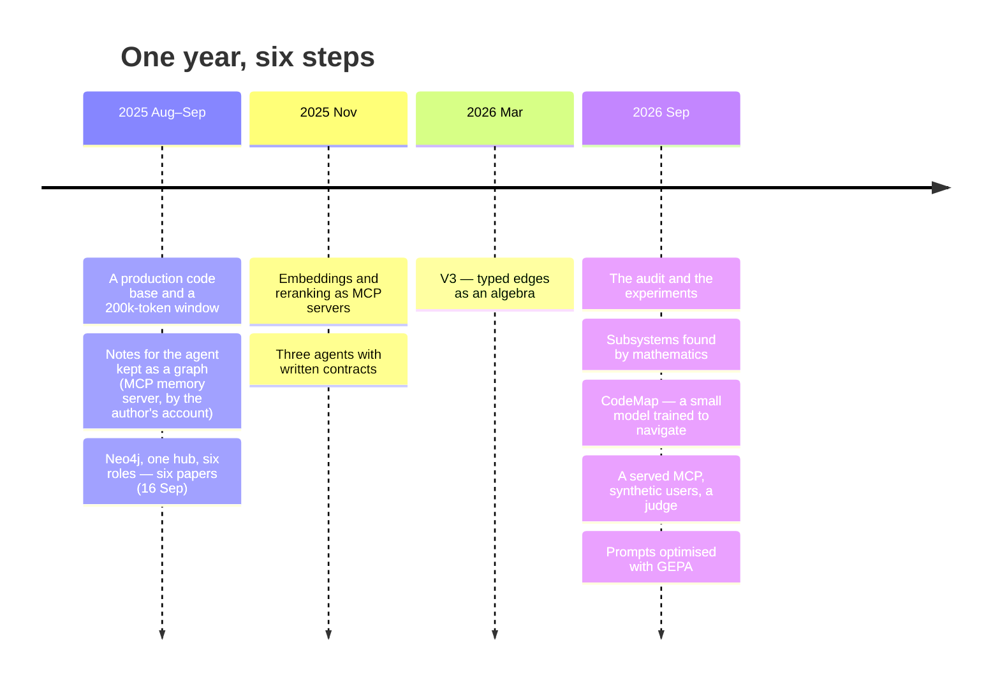

# The story: from a 200k window to a graph that agents query

This is how the method in this repository came to be, in the order it happened, with what each step
got right and what it got wrong. Dates in 2025 are commit dates; dates in 2026 are the ones written
in the documents each step links to.

## 1. The problem: a real system and a window it did not fit

In 2025 I was the lead engineer of [checkItOut](https://checkitout.app), a marketplace that went to
production, and I wrote most of its backend with coding agents in the loop. The backend was 426 Java
files at the time. The agent's
window was 200,000 tokens. That is large enough to be tempting — read everything, then answer — and
too small for the system: every session began by re-reading the same files, and by the time the
agent understood where a change belonged, a good part of the window was spent. Between sessions it
forgot all of it.

The fix was not a bigger window. It was to stop sending the code and send a **map** instead: let the
agent ask where things are, get back a handful of pointers, and open only those files. Retrieving a
few hops from a graph costs the same whether the system has four hundred files or four thousand;
reading costs more with every file, on every question.

## 2. A memory graph first

By my own account — the repository does not record this period — the first map was the simplest
one available. The Model Context Protocol had shipped with a reference *memory* server: a small
knowledge graph of entities, relations and observations that an agent can write to and read from. I
used it as the agent's notebook about the code base. What the repository holds is the two living
side by side: two debugging agents, committed on 30 September 2025, two weeks after the Neo4j
papers, that keep bug patterns, fix templates and a code graph in MCP memory
([`GPT5_ClineDebugger.xml`](../Promts/GPT5_ClineDebugger.xml),
[`Sonnet4_1M_ErdosDebugger.xml`](../Promts/Sonnet4_1M_ErdosDebugger.xml)).

It worked until the graph mattered more than the notes. A JSON file of entities has no query
language, no types on its edges and no way to ask "what depends on this, two steps out?".

## 3. Neo4j, one hub, six roles (September 2025)

So the map moved into a graph database, and got a shape:

- **One hub.** A single `NavigationMaster` node is where every session starts; under it, one
  navigator per subsystem; under those, the files. Three levels, so an agent is never more than two
  steps from a subsystem's index.
- **Six behavioural roles.** Every subsystem is read through the same six questions — who controls
  it, what configures it, what secures it, what implements it, what observes it, what moves it
  through time.
- **Typed relationships.** `TRIGGERS`, `VALIDATES`, `CONFIGURES`, `DEPENDS_ON` carry the *why*, so
  "what breaks if I change this?" is a query before the change, not a search after the incident.

The first public commit is 16 September 2025: six papers and a README that already described
"queryable knowledge graphs that serve both human developers and AI agents". Indexing the system
took about thirty context windows of one model and three or four of another
([author's note](AUTHORS-NOTE.md)); the graph held 24,030 nodes for those 426 files. Two worked
examples from that month are still the best introduction:
[documentation generated on demand](../GraphTheoryInSystemModeling/04_Living_Documentation_On_Demand_Real_Example.md)
and [a new feature placed with the graph](../GraphTheoryInSystemModeling/05_Living_Documentation_How_To_Add_Seat_Model_Real_Example.md),
both with their screenshots.

**What that period got wrong.** The papers explained the design with more mathematics than it had
earned — the Friendship Theorem for the hub, $R(3,3)=6$ for the six roles, homotopy type theory for
the clustering — and reported gains (hallucinations from 35 % to about 9 %) that came from one
informal pilot: fifty tasks, one system, one rater. The design was sound and the numbers were not
evidence. The papers are kept as written, each now with a status line, and the
[mathematics page](MATHEMATICS.md) says which claims survived.

## 4. Retrieval as a tool, and agents with contracts (November 2025)

Two things an agent needed beside the graph became MCP servers of their own: an
[embedding server](../McpServerForEmbeddings/) and a [reranking server](../McpServerForReranking/),
so "find the files about refunds" is a tool call rather than a guess.

And the work of building the graph was split between three agents, each with a written contract
instead of an ad-hoc prompt ([`Promts/`](../Promts/)): **Hypatia** indexes files into typed nodes
and edges, **Grothendieck** organises them into subsystems, **Erdős** reads the result and writes
the navigation clues. Five generations of those contracts are in the repository. Writing them as
specifications is what later made it possible to test them.

## 5. V3: the edges become an algebra (March 2026)

Free-form relationship names do not scale: two agents will describe the same coupling with two
different words. V3 fixed the vocabulary — six file roles (Actor, Process, Rule, Event, Context,
Resource, replacing the earlier six) and seventeen edge types — and wrote down
which edges may exist and which compositions mean something, as a quiver with relations
([`HypatiaBasis.md`](../GraphTheoryInSystemModeling/V3/HypatiaBasis.md)). The indexer may only emit
what the algebra allows.

V3 also carried the most ambitious mathematics of the project: a magnetic Laplacian over the
directed graph, per-relation random projections, a gauge-theoretic reading of the whole thing.

## 6. The audit, and subsystems found by mathematics (September 2026)

Then I audited my own corpus
([`V3_ResearchAudit_2026-09.md`](../GraphTheoryInSystemModeling/V3/V3_ResearchAudit_2026-09.md)) and
ran the experiments it asked for. Most of the ambitious constructions did not survive: the magnetic
Laplacian shattered the graph into 857 fragments, the rotation model lost to a single scalar on
every edge signature, a published anti-correlation did not reproduce. One audit finding concerned
no theorem at all: a scenario in an early paper that was formatted like a measured engagement. It is
labelled now.

What survived is smaller and better. Subsystems are now found without supervision by combining two
independent partitions — one from what files say, one from how they change — on the partition
lattice, and the result was accepted only because it beat both of its parents on held-out history
in 18 of 20 splits, a bar written down before the run. The details, the formulas and the full list
of what was withdrawn are on the [mathematics page](MATHEMATICS.md). A person still curates the
result; the decisions are [recorded](../applications/CodeMap/graph/CURATION_REPORT.md).

## 7. CodeMap: the method, shipped

[CodeMap](../applications/CodeMap/) is the method as a program. The graph is precomputed into a
pack; a small local model (4 billion parameters, running on a CPU) was trained to navigate it
through a language of thirteen verbs — `map`, `enter`, `find`, `impact`, `flow`, `seam`, `cohort`,
`spine`, `health`, `read`, `cache`, and the two endings `answer` and `pass`. It returns pointers,
never file contents, and when the answer is not in the graph it says so instead of inventing one.
([One recorded question, replayed step by step](https://claude.ai/artifact/GwUEay3qmwnqrANh7yY7pm).)
Training took it from zero to 0.975 execution accuracy on a held-out test set, half of it about
entities it had never seen ([training story](../applications/CodeMap/docs/04-training-story.md)). The shipped stack no
longer needs Neo4j: the graph runs on an embedded engine, with gold answers identical across the two.

## 8. Measured in the open, including the night it lost

In September 2026 the graph became a [served MCP](../applications/CodeMap/remote/README.md) with
seven tools, six synthetic users with different jobs who verify every pointer in their own checkout,
and a judge calibrated against the execution oracle. An evaluation gate now ties every published
number to a committed artifact on every push.

The first full comparison went against it. Over 35 paired tasks, agents with CodeMap used more
tokens, more turns and more time than agents with grep — because they asked the navigator for prose
answers instead of walking the graph themselves. That is recorded as it happened, under a banner
that says "not a success story" ([evidence](EVIDENCE.md)). The graph is cheap to query; an agent has
to be taught to query it.

## 9. Prompts under test

The last step turns the same discipline on the prompts themselves. A prompt is treated as code under
test: a contract of checkable rules, tasks with hidden acceptance tests, a blind judge, and
[GEPA](RELATED-WORK.md) to rewrite the prompt against the measurement. It was run on three prompts:
the navigator's (a new version promoted), the architecture manual (cheaper to run and judged worse,
so not a win) and a team's coding conventions (better on held-out tasks, not by enough to certify —
[the full report](PROMPT-UNDER-TEST.md)).

## What changed, and what did not

The window that started this is five times larger now. It did not make the map unnecessary: a model
still attends worse to the middle of a long context, every token is paid for on every question, and
a team's code base grows faster than any window. What changed is the job. In 2025 the graph was the
only way to fit the system into the agent's head. Today it is a way to send less.

It is not finished. The graph beats reading at telling an agent *where to look*; it has not yet been
shown to make an agent *cheaper end to end*, and the page that says so is [the evidence](EVIDENCE.md).

Back to the [README](../Readme.md) · [related work, with dates](RELATED-WORK.md) ·
[documentation index](README.md)
